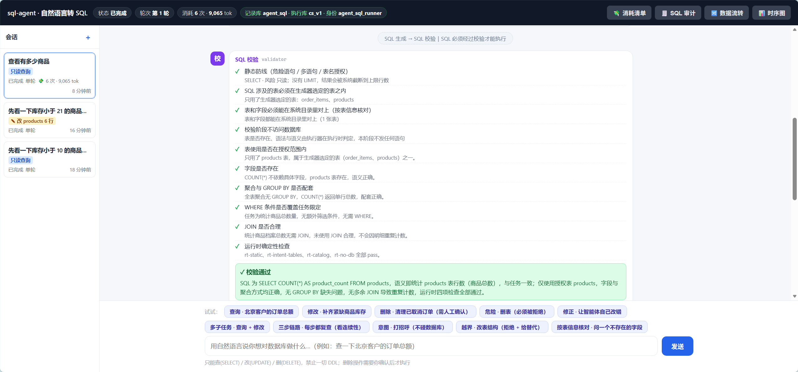
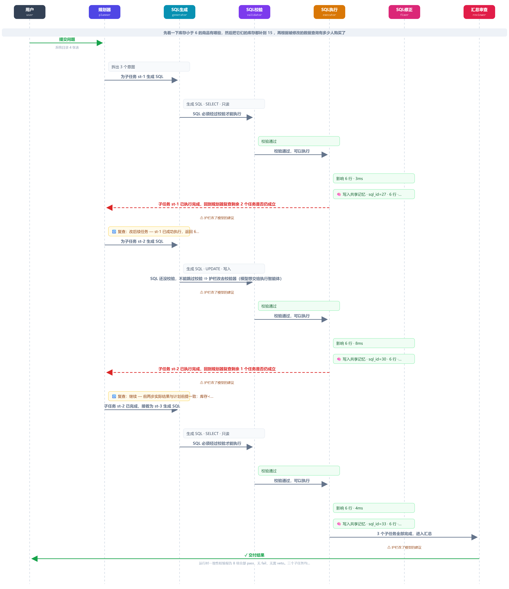
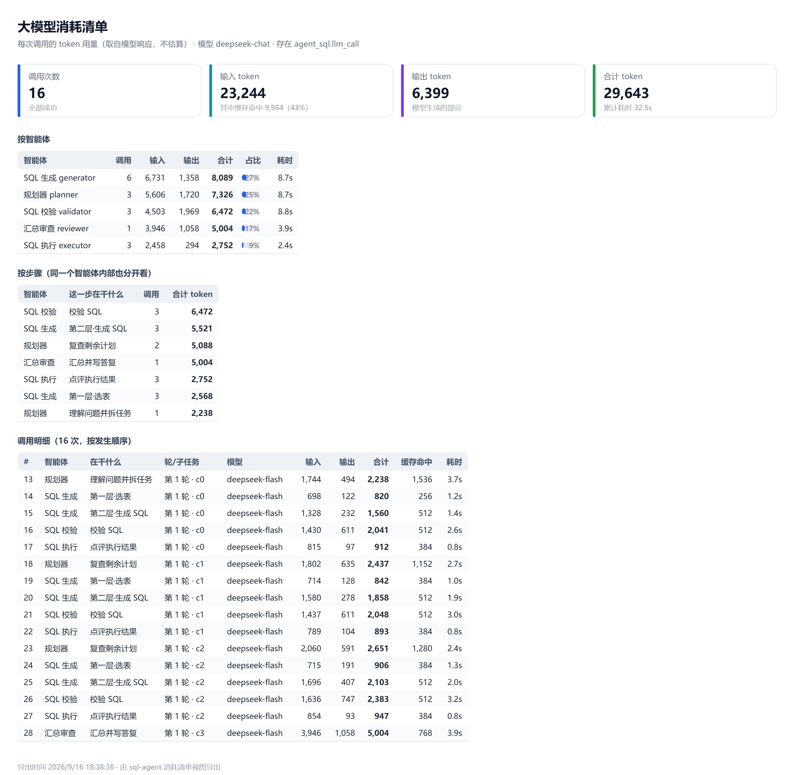

# 多智能体协作 · 一致性校验

用 **LangGraph 1.x + LangChain 1.x** 搭的两个可运行项目，为同一个论点做论证：

> **多 Agent 最危险的状况不是意见不同，而是每个 Agent 都在自己的世界里正确。**

论证的完整原文 —— 来源文章、四个关键追问、从"任务为什么要拆"到"凭什么相信它完成了"的完整推理 ——
在 **[`demo-validation/多Agent协作一致性.md`](./demo-validation/多Agent协作一致性.md)**。

这份 README 只讲一件事：**为了论证它，我们做了什么、设计了什么、最后证明到了什么程度。**

要论证的不是"几个 Agent 一起说了句话"，而是"一致"这两个字怎么落进代码：

> 一致 ≠ 让所有 Agent 说出同一个答案。要对齐的是三件事 ——
> **处理的是不是同一个任务、依据的是不是同一份事实、推进的是不是同一套状态。**
>
> 推理可以有分歧，协议不能含糊。
> **模型负责判断，运行时负责证明。**

---

## 论证方式：把抽象主张变成「能跑 + 能看 + 能校验」

| 文章里的主张 | 只写在文档里会怎样 | 这次论证怎么落地 |
| --- | --- | --- |
| 交接的应该是**工作状态**，不是聊天记录 | 停在口号 | 交接物是共享状态 + 结构化交接块；界面上画出"谁把什么交给了谁" |
| "同一份事实" | 没法判断 | 事实来源**外部给定且可校验**：引用要逐字命中原文；表名字段名要对上系统目录 |
| "审查必须能改变后续状态" | 审查沦为评论 | 审查结论变成**下一轮的真实输入**：退回重查 / 换掉后续计划 / 提前收尾 |
| "完成是状态机里的一个状态" | 靠模型说"我做完了" | **确定性不变量**逐条判，任一条 fail 就推翻模型的 approve |
| 多 Agent 的复杂度 | 停在架构图 | 两个项目都跑得起来、有离线自检、有真实模型逐条对账 |

**两个项目不是两套并列的 demo，是同一论证的两段**：先用一个**没有副作用**的场景把协议立住，
再把同一套骨架推到**有副作用、多子任务、要花钱、输入不可信**的真实场景里去压。

---

## 两个项目

| | [`demo-validation`](./demo-validation) 🧊 | [`sql-agent`](./sql-agent) |
| --- | --- | --- |
| **论证哪一段** | 前半段：**协议立不立得住** | 后半段：**协议顶不顶得住现实** |
| **做什么** | 通用问答：用户提问 + 给资料，四个智能体协作给答案 | 自然语言转 SQL：六个智能体协作生成 / 校验 / 执行 |
| **智能体** | 规划器 · 研究员 · 执行器 · 审查器 | 规划器 · SQL生成 · SQL校验 · SQL执行 · SQL修正 · 汇总审查 |
| **链路** | 固定：`规划 → 研究 → 执行 → 审查`（可否决回流） | **不固定**：每个智能体自己建议下一步，护栏决定能不能去 |
| **「同一份事实」靠什么** | 结论必须**逐字引用**用户给的原文 | 表/字段必须来自**系统内置目录**（不是读库读来的） |
| **多子任务怎么接上** | 单轮研究，无跨任务状态 | **共享记忆 + 六类结构化交接 + 每步复查**：上一步真跑过的值，下一步直接用 |
| **有副作用吗** | 没有（只出文字） | **有**（改数据、删数据）→ 所以多了三层防线 + 人工确认 |
| **状态** | 🧊 已校验冻结（2026-09-15） | ✅ 已完成并通过自检 |

怎么跑起来：各自的 `README.md`，以及 [`sql-agent/docs/03-搭建与使用.md`](./sql-agent/docs/03-搭建与使用.md)（从零搭环境 + 怎么用 + 排错）。

---

## 论证一 · `demo-validation`：先把「同一份事实」变成一条可检查的规则

> 🧊 **已冻结（2026-09-15）**，验证通过不再修改。冻结说明与结论见 [`FROZEN.md`](./demo-validation/FROZEN.md)。

### 做了什么

- **场景**：通用问答。用户提一个问题 + 给一份资料，四个智能体协作返回一个答案，**不限行业**
  （健康、代码、法律都行 —— 系统只要求一件事：结论必须引用用户给的原文，且**逐字命中**）。
- **为什么先做这个**：它**没有副作用**（只出文字），可以把"一致性"单独隔离出来验证，
  不被"改错数据""成本失控"这些变量干扰。**先证明协议立得住，再谈落地。**
- **没资料不干活**：只问问题不给资料，系统先追问补资料 —— 因为"引用依据必须真实存在"是这个系统唯一的硬约束。
- **四个智能体**：规划器（拆子问题）→ 研究员（逐个子问题查资料、给结论 + 原文摘录）
  → 执行器（汇总成答案，每个分点带依据）→ 审查器（核对 + 可否决回流）。

### 设计了什么

| 文章里的主张 | 设计 | 落在哪 |
| --- | --- | --- |
| 权威事实不能被摘要替代（"摘要不能取代事实出处"） | 用户资料切分成 `source_chunk`，作为**权威事实层**，只读不改；结论只能引用它 | `app/sources.py` |
| 事实来源必须**可校验** | `Citation(source_id, quote)`：运行时把摘录去空白后回原文做**字符串匹配**，找得到才算数。容忍换行缩进，**不容忍改写** | 不变量 V2 |
| 允许**诚实地不知道** | `insufficient` 显式声明通道：沉默不行、编造更不行，但"这份资料答不了这个问题"是**合法出路** | V1 / V3 / V5 |
| **同一个任务** | `global_task_id` + `sub_task_id`；认领用**租约**（`lease_until`），幂等键防重复执行 | `agent_task` |
| **同一套状态** | 共享 `TaskState` + `version` 单调递增，**过期写入不允许覆盖新状态** | V7 |
| **完成 = 状态机里的一个状态** | 8 条**确定性**不变量（不看模型的自我声明），其中 V6 判"拆出来的每个子问题都真被回答" | `app/validators.py` |
| **审查必须能改变后续状态** | 否决 → 退回研究员补查 → 版本 +1 → 下一轮。**回流没有任何人为注入**，只在模型真的漏答 / 改写引用时发生 | `app/agents.py` |
| **硬门禁** | 任何一条不变量 fail，审查器的 `approve` 被运行时**强制改写成 `veto`** | `reviewer` 节点 |
| 交接的不是聊天记录 | 交接条写明「谁把什么交给了谁」（虚线胶囊） | 界面 |

### 实现效果

- **两个真实场景（离线可复现）**：
  - 场景 A · 资料覆盖了问题 → 1 轮通过，**12 条引用全部逐字命中**，0 次否决
  - 场景 B · 资料答不上问题 → 1 轮通过，0 条引用，**3 个分点显式声明"资料不足"**
  - 两个场景都：不编造、不漏答、以 `done` 结束
- **自检**：18 个文件编译通过 · 前端 JS 语法通过 · 契约 + 引用校验 **13/13** ·
  Web 端到端（两个真实场景）**15/15**
- **论证给出的第一条边界**（后面所有设计都受它约束）：

  | 运行时**能**证明 | 运行时**证明不了**（交给审查器） |
  | --- | --- |
  | 这句话**确实逐字来自**你给的资料（字符串匹配，确定性） | 这句话是否**支持**得出的结论（语义判断） |

  → 所以运行时和审查器**缺一不可**：一个管结构，一个管语义。
- **论证过程里被证伪的一个想当然**：「资料答不上来」一开始会被判**失败**（V2/V5 当时要求"必须有引用"）——
  诚实地承认不知道，反而判不合格。于是补了 `insufficient` 显式声明通道。
  **这类发现正是做"可运行论证"而不是"写设计文档"的意义。**

---

## 论证二 · `sql-agent`：把论证推到「有副作用、多子任务、要花钱」的地方

### 做了什么

第一版把协议立住了，但它有一半问题**证不出来**：真实系统里 Agent 会改数据、会遇到"每一步都成功但合起来答错了"、会花钱、
还会碰到不怀好意的输入。所以第二个项目换了一个必须面对这些的场景：

**你说一句话，六个智能体协作生成 / 校验 / 执行 SQL，失败自动修正；删除操作停下等你确认；任何 DDL 一律拒绝。**
支持多轮追问，也会先判**你这一句到底想要什么**（聊天 / 要 SQL / 要评估 / 真的要执行）。

| 第二版新加的难处 | 它证出了第一版证不出的什么 |
| --- | --- |
| **有真实副作用**（改、删数据） | 必须回答"凭什么敢让模型碰数据库" → 四层防线 + 人工确认 + 权限兜底 |
| **多子任务** | "三个子任务各查各的，每条链都成功，合起来答错问题" —— 一致性在**跨任务**层面的真实失败模式 |
| **要花钱** | 多智能体最容易被问"这一轮到底花了多少" → 消耗必须**逐条可对账**，不能估算 |
| **用户输入不可信** | 用户可能夹带 SQL、可能提到不存在的表 → 越界必须在**运行时**确定性地拦住，不指望模型自觉 |

### 设计了什么

#### ① 任务：链路不固定，但边界一条不松（对应"两个 Agent 结论不一样，谁来拍板"）

| 文章里的主张 | 设计 |
| --- | --- |
| 分歧本身有价值；麻烦的是它们**基于不同现实却被当成同一现实汇总** | 每个智能体产出时带 `handoff_to`（自己建议下一步交给谁），`router` 节点用**运行时候选集**过滤：候选只有一个 → 模型的建议无效（硬边界）；候选有多个 → 让模型在合法范围内自己选（真正的协作自由度） |
| "不是随机乱走，而是该有分歧的地方允许分歧" | 真正多选的只有两处：**校验不通过**（小修 vs 重新理解问题）、**执行失败**（改 SQL vs 重新拆问题） |
| 护栏行使了决定权，就得让人看见 | 界面上标「**护栏改道**（模型原本想给 X）」+ 改道理由；正常的推进（上一步做完接着做下一步）**不标成告警** |

#### ② 事实：权威来源可校验，且**不由系统自己去偷看**（对应"同一份事实"）

| 文章里的主张 | 设计 |
| --- | --- |
| 权威事实不能被摘要替代 | 表 / 字段 / 关系写在外部数据文件 `config/tables.json`（**数据，不是代码**）。换库、换租户、换环境改它就行，运行时可热换 —— **验证逻辑里一处硬编码都没有** |
| —— | **校验阶段零数据库操作**：表和字段按目录**静态核对**，"SQL 能不能跑"由**执行器**给出数据库原话。于是「系统以为的库」和「真实的库」**允许不一致**，而不一致时的报错必须真实地暴露出来，这才测得出修正智能体到底会不会处理 |
| —— | **SQL 只能由生成器根据任务产出**：用户只能提问，输入里夹带 SQL 一律运行时拒掉；用户提到的表不在目录里就直说不可用，**绝不拿另一张表顶替**（换表顶上 = 换了问题） |
| **共享记忆记录引用和状态，不能取代权威数据源** | `agent_memory` 每条带 `sql_id` + SQL 原句，可回查；只有**真正执行过**的语句才算事实 |

#### ③ 状态：连续性 —— 第二版真正的主场

多子任务最容易**假成功**：1 查出来的商品 id，2 和 3 拿不到，于是三步各查一遍全表，
每条链单独看都"跑通了"，合起来答的却不是同一个问题。连续性钉在四个地方，缺一个都断：

| 环节 | 落在哪 | 干什么 |
| --- | --- | --- |
| **① 共享记忆** | 表 `agent_memory`（写它的只有执行器） | 只有**真正执行过**的语句才算"事实"，每条带 `sql_id` + SQL 原文，可回查来源 |
| **② 六类结构化交接** | `prompts.HANDOFF_BLOCK` | 每次交接按六类给状态：基于哪一版 / 已确认什么 / 仍在猜什么 / 允许做什么 / 产物在哪里 / 怎样算完成 |
| **③ 依赖显式化** | `depends_on` / `acceptance` | 每个子任务声明**依赖谁**、**怎样算完成**；交接时按依赖取记忆，不把无关结果全灌进去 |
| **④ 复查循环** | 路由规则「做完一个 → 先回规划器」 | 每完成一个子任务就回规划器，拿**实际结果**判断：`continue` / `revise` / `finish` |

两条被论证逼出来的硬约束（都写进了代码注释）：

- **「已确认的事实」这一栏只可能来自共享记忆** —— 模型自己说的话进不来。没有这一层，
  下游拿到的不是任务，只是一句传闻。
- **复查同一位置只做一次**（`replanned_cursor`），否则"做完一个就复查"会原地打转；
  **`revise` 必须清掉上一版 SQL**、**`finish` 必须把剩余任务从计划里去掉** ——
  前者防"改了计划却没改动作"，后者防一致性校验把规划器刚做出的结论**再推翻一次**。

#### ④ 完成与失败：完成是状态机里的状态，不是回复里的句号

| 文章里的主张 | 设计 |
| --- | --- |
| 验收要看证据而非措辞 | 8 条运行时一致性不变量（S1–S8）：SQL 必须经过校验才能执行、需确认的必须有确认记录、执行过的必须有结果留痕、执行记录必须带幂等键……**任一条 fail，汇总审查器的 `approve` 被强制改写成 `veto`** |
| 子任务状态：未执行 / 执行中 / 已完成 / 失败 / **状态未知** | `agent_task.status` 里留着 `unknown`（状态未知 ≠ 失败）；当前链路只用到 `failed`，并配合**无进展检测**主动停止（同一条 SQL 失败 ≥2 次、或同一错误连现 ≥2 次 → 停止重试并把过程摊开）。**超时补偿那一套还没实现** |
| 失败重试要落在子任务层 | `(global_task_id, sub_task_id, attempt)` 主键 + 租约 + **唯一幂等键**，防"点两次确认执行两遍" |
| 完成要有人的位置 | 删除类操作 `interrupt()` 真暂停，确认卡片写清风险级别 / 涉及表 / 预估影响行数 / **级联删除提醒**；点取消**一行都不改** |
| 重试不能无限打转 | 修正器拿到**数据库原话**重写，已试过并失败的 SQL 会喂回去（**明令不许重复**），并给了 `give_up` 出口 |

#### ⑤ 安全：应用层负责解释，权限层负责保证

| 层 | 做法 | 作用 |
| --- | --- | --- |
| 应用层 | 危险语句扫描 + 风险分级（禁止 / 需确认 / 自动） | 负责**解释与体验**：让用户看到"为什么不允许"，而不是等数据库报错 |
| 表信息层 | 按系统目录核对**表与字段** | 负责**拦在进库之前**：挡住"表对了、字段是编的" |
| **数据库层** | 受限角色**只有增删改查权限，没有任何 DDL** | 负责**兜底与保证**：应用层校验可能被绕过，**权限绕不过去** |
| 执行沙箱 | 事务 + 超时 + 结果行数上限 + 影响行数阈值 | 限制**爆炸半径** |

#### ⑥ 观测：把"真实发生过什么"记下来（对应"生产环境观测指标"）

| 文章里的指标 | 本项目的落点 | 现状 |
| --- | --- | --- |
| 任务重复率 | 幂等键唯一约束 + 租约 | 已实现 |
| 状态冲突率 | `version` 乐观锁（更新带 `AND version = %s`，影响 0 行即丢弃过期写入） | 已实现 |
| 补偿成功率 | 失败 → 修正器重写 + 无进展主动停止 | 已实现 |
| 状态未知积压量 | `status='unknown'` 位已留 | **未实现**（超时后查远端状态未做） |
| 调度可用性 | 单进程 + 并发信号量 | 演示级，未做多实例调度 |
| 归档前确认（无活动租约 / 重试 / 补偿） | 事件账本 + SQL 审计全程留痕 | 部分：可查，未做归档流程 |
| ——（本项目自己加的）单轮成本 | `llm_call` 消耗明细：次数 / 输入输出 token / 缓存命中 / 耗时 / 成败，逐条可查 | 已实现 |
| ——（本项目自己加的）过程可回放 | 每个节点**真正交出去的状态增量**落库（不只是广播的事件） | 已实现 |

### 实现效果

- **连续性**（离线端到端，三个有依赖的子任务）：依次落地 · 每步写一条共享记忆 ·
  两次复查事件都在 · `revise` 改计划会清旧 SQL · `finish` 提前收尾时计划跟着缩。
  界面上看得到 `🧠 写入共享记忆 · sql_id=44 · 可复用实体：products.id = 1、3、5…` 和 `🔁 规划器复查`。
- **安全**：99 项静态防线对抗性用例全过；两库隔离 + 权限兜底实测
  （删表 / 清空 / 改结构 / 建表 / 删库全被拒，提权尝试后权限快照完全一致）。
- **真实模型消耗对账**：一轮只读查询 = **6 次调用 · 8,462 输入 + 1,736 输出 = 10,198 token**
  （其中 4,096 命中提示词缓存），每次调用的 role / stage / 耗时逐条可查。
- **真实危险请求**：「删掉 orders 表」被直接拒绝并给出替代方案，**未产生任何 SQL**。
- **真实多轮对话**：同一会话内追问，能拿到上一轮**实际执行过的 SQL**。
- **界面能看见什么**：对话流（每步可折叠）· 协作时序图（7 条生命线，可导出 PNG / SVG）·
  数据流转链路（含**原样落库的完整结构**，例如执行器只广播了"返回 8 行"，
  但它交出去的状态里带着整棵 EXPLAIN 计划树）· 消耗清单 · 会话列表（一眼看出哪次真的改了数据）。

### 界面与产物（下面全是真实运行导出的，不是示意图）

**主界面** —— 左侧会话列表（一眼看出哪次真的改了数据）、中间对话流（每一步都能展开，
这里是校验器把 11 条检查逐条摊开）、底部示例问题：



**协作时序图** —— 7 条生命线，每做完一个子任务就回规划器复查一次（虚线箭头）。
图上是三个**有依赖**的子任务：先查库存 < 6 的商品 → 把这些库存补到 15 → 统计被改的商品各有多少人购买：



**大模型消耗清单** —— 同一个问题的账：**16 次调用 · 23,244 输入 + 6,399 输出 = 29,643 token**，
按智能体 / 按步骤 / 按调用三种口径都能一路对到明细行：



另外两份是**导出的完整 HTML**：样式全部内联、零外部依赖，**下载后双击就能在任意浏览器打开**
（不用连网、也不用起服务）。GitHub 不渲染仓库里的 `.html` 文件，所以折叠在这里：

<details>
<summary><b>📄 数据流转链路 · 完整 HTML 导出</b>（12 次流转 · 124 条事件 · 2 次复查 · 3 条共享记忆 · 4 次护栏改道）</summary>

<br>

一轮运行的**全部流转**。卡片上写的是人话摘要（挑出来的那几个字段），每张卡片底部另附
**原样落库的完整结构** —— 节点 `return` 出去的状态增量（`state_delta`），
那才是**下一个智能体真正读到的东西**。

- 文件：[`sql-agent/jpg/数据流转链路.html`](./sql-agent/jpg/数据流转链路.html)
- 在线预览：[htmlpreview 打开](https://htmlpreview.github.io/?https://github.com/li-byte/multi_agent_collaboration/blob/master/sql-agent/jpg/%E6%95%B0%E6%8D%AE%E6%B5%81%E8%BD%AC%E9%93%BE%E8%B7%AF.html)（**第三方**预览服务，且要先 `git push` 上去才打得开；不想用它就直接下载上面的文件双击）

</details>

<details>
<summary><b>📄 会话记录 · 完整 HTML 导出</b>（一个会话的全部轮次 · 页眉带状态与消耗 · 可直接打印成 PDF）</summary>

<br>

点顶栏「📄 导出会话」拿到的就是它：**同一个会话的全部轮次**都在这一个文件里。
导出走的是**和界面同一套渲染**（写两套渲染，早晚会说两套话），但去掉了一切"要点击才成立"的东西 ——
确认按钮、视图入口、等待动画都不产生；当时在等确认的地方写明「⏸ 当时在等用户确认」，
页眉带上状态 / 轮次 / 改了什么数据 / 消耗。

- 文件：[`sql-agent/jpg/会话记录.html`](./sql-agent/jpg/会话记录.html)
- 在线预览：[htmlpreview 打开](https://htmlpreview.github.io/?https://github.com/li-byte/multi_agent_collaboration/blob/master/sql-agent/jpg/%E4%BC%9A%E8%AF%9D%E8%AE%B0%E5%BD%95.html)（**第三方**预览服务，且要先 `git push` 上去才打得开；不想用它就直接下载上面的文件双击）

</details>

---

## 实现效果总结

### 一、文章的四问，两个项目各给了一个可运行的答案

| 文章的四问 | `demo-validation` 的答案 | `sql-agent` 的答案 |
| --- | --- | --- |
| **为什么拆 / 怎么拆** | 规划器拆子问题；租约 + 幂等键把"不重复"变成数据库可检查的事实 | 规划器拆子任务 + **动态链路** + **每步复查**（拆完还能改：continue / revise / finish） |
| **交接什么** | 可继续工作的状态（子问题 / 结论 / 引用）+ 交接条 | **六类结构化交接** + 依赖显式化 + **带来源的共享记忆** |
| **冲突谁拍板** | 结论打标（候选 / 已验证 / 冲突 / 已否决）+ 8 条不变量 + 硬门禁 | 校验器（零数据库操作）+ 运行时不变量 + 硬门禁 + **护栏改道**并标注 |
| **凭什么信"完成了"** | V6 子问题覆盖率 + 版本推进 + 幂等键 | S1–S8 + SQL 审计状态机 + 人工确认记录 + 无进展主动停止 |

### 二、论证的边界：运行时能证明什么，证明不了什么

这是全篇最要紧的区分 —— **运行时能证明的东西是有边界的，边界外必须交给审查器。**

| | 运行时**能**证明 | 运行时**证明不了**（交给审查器） |
| --- | --- | --- |
| `demo-validation` | 这句话**确实逐字来自**你给的资料（字符串匹配，确定性） | 这句话是否**支持**得出的结论（语义） |
| `sql-agent` | 没越权、校验过才执行、确认过才删（全部确定性） | 这条 SQL 是否**真的完成了**你的意图（语义） |

所以两套系统里，**校验器和审查器缺一不可**：一个是确定性的，一个是语义的。
**"多智能体"本身不是卖点，"接得上、拦得住、说得清"才是。**

### 三、两套系统共用的设计骨架

同一套骨架换了场景还能用，这本身就是论证的一部分：

| 设计 | 说明 |
| --- | --- |
| **共享状态是唯一交接载体** | Agent 之间传的是可继续执行的工作状态，**不是聊天记录** |
| **事实要带来源** | 每条事实都带可回查的引用（资料片段 / `sql_id` + 原句）：记录引用和状态，**不取代权威数据源** |
| **交接按结构给全，不给一句传闻** | 六类：基于哪一版 / 已确认什么 / 仍在猜什么 / 允许做什么 / 产物在哪里 / 怎样算完成 |
| **观测与业务分开** | 消耗明细写账失败只记日志，不影响主流程 —— 观测坏了不能拖垮任务 |
| **硬门禁** | 运行时校验不过，模型的 `approve` 一律被改写成 `veto` |
| **事实来源必须可校验** | 引用要能定位到原文；表名字段名要能对上系统目录 |
| **权威层只读** | Agent 只能引用，不能改写事实 |
| **账本** | 租约 / 幂等键 / 乐观锁 / 事件回放 / 大模型消耗明细 —— 与业务无关的通用能力 |
| **接入层适配器** | LLM 输出先归一化再进契约（嵌套对象被序列化成字符串、list 写成换行长文本……这些坑都踩过） |
| **两条防线分工** | 运行时抓结构，审查器抓语义 |

### 四、校验结果

```
demo-validation  🧊 已冻结
  Python 编译 / 前端语法        ✅ 18 个文件
  契约 + 引用逐字校验           ✅ 13/13
  Web 端到端（两个真实场景）    ✅ 15/15
       资料覆盖问题 → 1 轮通过 · 12 条引用全部逐字命中
       资料答不上   → 1 轮通过 · 0 条引用 · 显式声明「资料不足」

sql-agent
  Python 编译 / 前端语法        ✅ 23 个文件
  静态防线（对抗性用例）        ✅ 99/99（危险语句 / 偷换表 / 目录外表 / 字段核对 / 夹带 SQL 的用户输入）
  路由护栏 + 复查循环           ✅ 33/33（复查只在一个位置做一次 + 执行失败不当成"做完了"）
  提示词模板渲染 + 关键约束     ✅ 24/24（含六类交接块、复查提示词）
  消耗统计（token 从哪儿读）    ✅ 20/20（两种用量字段 + 缓存命中 + 思考 token + **读不到就记 0，不估算**
                                  + 接口序列化对 datetime/字符串两种时间形状都要能吃）
  四个导出的产物                ✅ 74/74（假 DOM 里真调一遍导出：PNG 底图是合法 XML 且元素不溢出、
                                  时序图补 width/height、canvas 失败回退 SVG；
                                  两份 HTML **零外部依赖**，换台机器双击就能打开；
                                  会话记录正文里没有任何"要点击才成立"的控件）
  两库隔离 + 权限兜底           ✅ 全部符合预期（含提权尝试）
  多子任务连续性（离线端到端）  ✅ 三个有依赖的子任务依次落地 · 每步一条共享记忆 ·
                                   两次复查事件 · `revise` 改计划会清旧 SQL ·
                                   `finish` 提前收尾时计划跟着缩
  真实 DeepSeek 消耗对账        ✅ 一轮只读查询 = 6 次调用 · 8,462 输入 + 1,736 输出
                                   = 10,198 token（4,096 命中提示词缓存），逐条可查
  真实 DeepSeek 危险请求        ✅「删掉 orders 表」被直接拒绝并给出替代方案
  聊天 vs 数据问题             ✅ chat 不碰库，也不会回「已处理 0 个操作」
  多轮对话                     ✅ 同一会话内追问能拿到上一轮实际执行的 SQL

  ※ 界面链路（只读 / 修改 / 删除+确认 / 删除+取消）不设自动化端到端脚本：
    那种脚本走的是和用户点界面同一个 POST /api/runs，跑一次就往会话列表里塞假会话。
    会话只能由人在界面上对话产生。
```

### 五、结论

1. **"一致性"是可以被设计成可检查的。** 两个项目里没有一条一致性要求靠"提示模型注意"来保证 ——
   全部落在运行时的确定性检查上：引用要能逐字命中、表字段要对上目录、没校验过的 SQL 到不了执行器、
   没确认过的删除不会发生。**模型负责判断，运行时负责证明。**
2. **边界不能空着。** 运行时证明不了的东西（这条 SQL 是否真的完成了你的意图、这句引用是否支持结论），
   明确交给审查器，并且允许它**改变后续状态** —— 审查改变不了动作，就只是评论。
3. **同一套骨架换场景依然成立。** 从"只出文字"的问答到"会改数据"的 SQL 执行，
   共享状态 / 带来源的事实 / 六类交接 / 硬门禁 / 账本这五件事一件没换，加的是防线和观测。
   换场景要加的从来不是新概念，是把已有边界落实。
4. **代价也是结论的一部分**：界面的四条链路现在只有手动演示、没有自动化端到端；
   每个子任务的修正轮次还共享一个全局上限；写操作抽不出具体实体。
   这些都在各自的文档里写明了 —— **论证的可信度取决于它敢不敢标出自己的边界。**

---

## 技术栈

`Python 3.10` · `LangGraph 1.x` · `LangChain 1.x` · `DeepSeek (function calling)` ·
`FastAPI + SSE` · `PostgreSQL` · `psycopg 3` · `sqlparse` · 原生 HTML/JS（无构建步骤）

---

## 目录

```
.
├── demo-validation/          🧊 通用问答（已校验冻结）
│   ├── 多Agent协作一致性.md    **论证的出发点：来源文章 + 四个关键追问 + 金句**
│   ├── FROZEN.md             冻结说明与验证结论
│   ├── app/                  sources / validators / agents / graph / ledger ...
│   ├── web/                  对话式界面（引用 chip 可点回原文）
│   └── docs/                 早期设计与通用版设计文档
│
└── sql-agent/                自然语言转 SQL
    ├── app/                  catalog / catalog_check / prompts / sql_guard / router / db / agents ...
    │                         ↑ catalog：加载表目录（**表信息是数据，不是代码**）
    │                           catalog_check：按这份目录静态核对 SQL 的表与字段
    │                           prompts：**所有提示词**都在这一个文件里
    │                           router / agents：动态链路 + 复查循环（每做完一步回头看）
    ├── config/tables.json    表名 / 字段 / 关系都在这 —— 换库换租户改这里，代码不动
    ├── sql/                  biz.sql(cs_v1) · ledger.sql(agent_sql，含 agent_memory) · seed.sql
    ├── web/                  对话式界面（人工确认卡片 + 协作时序图 + 数据流转 + 消耗清单）
    ├── docs/00-产品介绍.md     **产品视角**：为谁解决什么、凭什么敢用、边界与指标（不含代码）
    ├── docs/01-设计说明.md     从冻结版继承了什么、改了什么
    ├── docs/02-运行流程.md     一轮运行的完整时序（逐事件，真实抓取）
    ├── docs/03-搭建与使用.md   **从零搭环境 + 怎么用 + 排错**（新手上手看这份）
    ├── jpg/                  界面与导出的真实产物（主界面 / 时序图 / 消耗清单截图 + 两份 HTML 导出）
    └── scripts/              9 个脚本（7 个离线校验 + 建库 + 清账本）
```

各项目的完整说明见 [`demo-validation/README.md`](./demo-validation/README.md)
与 [`sql-agent/README.md`](./sql-agent/README.md)；踩过的坑与修法留在各自的文档里
（`sql-agent/README.md` 的"修正闭环的坑"表、`demo-validation/FROZEN.md` 的实施过程记录）。
