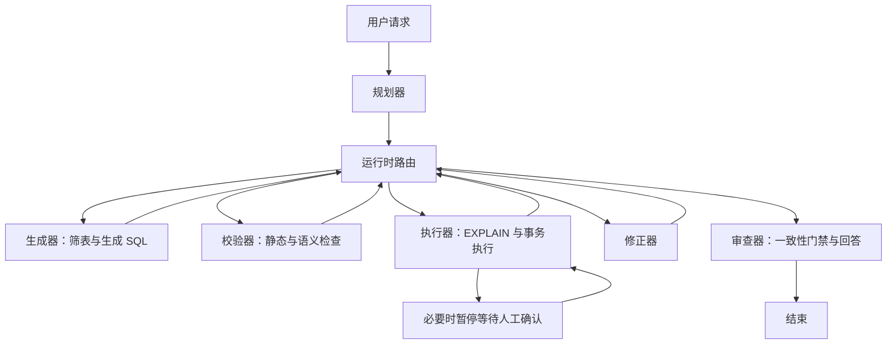

# 从 sql-agent 沉淀的多智能体协作指导方针

编写日期：2026-10-07。依据：本地仓库提交 `6c932ff33c1b2f437b719e2bbbf24cba2cec369b` 的 `sql-agent` 源码与项目文档。

本文把可复用原则、项目中的实现和仍需补齐的能力分开描述。结论来自静态代码审阅，本次未连接数据库、未调用模型运行端到端测试；不能把设计存在等同于生产可靠性已经验证。

## 1. 项目提供的协作范式

sql-agent 是一个自然语言驱动的数据库任务系统：规划器拆解意图，生成器选表并生成 SQL，校验器检查约束和语义，执行器负责数据库操作，修正器处理失败，审查器汇总结果。LangGraph 的 router 根据状态决定下一个角色，模型可以提出交接建议。

它当前属于**共享任务状态、按游标串行推进、受运行时约束的多角色协作**。六个角色是节点函数，不是六个拥有独立会话、独立生命周期和消息队列的常驻 Agent。`depends_on` 提供依赖表达与结果交接，但当前没有按依赖图并行调度。



源码入口：[graph.py](../sql-agent/app/graph.py)、[agents.py](../sql-agent/app/agents.py)、[router.py](../sql-agent/app/router.py)。

## 2. 原则一：按责任和权限拆角色

角色应该有不同的输入、产物、权限和失败责任，而不是只更换提示词里的身份。

| 角色 | 核心责任 | 交付物 | 权限边界 |
| --- | --- | --- | --- |
| planner | 理解意图、拆任务、执行后复查 | intents、depends_on、acceptance、plan_action | 不负责选表、生成 SQL |
| generator | 从目录筛选表、生成 SQL | 表清单、SQL 草稿、交接建议 | 不操作业务数据库 |
| validator | 静态约束与模型语义检查 | checks、passed、原因 | 本项目要求零数据库操作 |
| executor | EXPLAIN、确认、事务执行 | 真实结果、错误、审计和共享事实 | 唯一承接任务 SQL 的角色 |
| fixer | 根据真实错误修正 SQL | 新草稿、修改解释、give_up | 继承已选表范围，不扩大访问范围 |
| reviewer | 综合任务证据、检查一致性、回答用户 | approve/veto、最终答复 | 无权推翻运行时否决 |

这里的“唯一执行器”指 Agent 任务路径中的业务 SQL。初始化脚本、连接身份检查等基础设施操作需要另行管理，不能把角色约束夸大成整个应用只有一个函数访问数据库。

通用要求：每个角色必须能回答“我收到什么、我要交付什么、我不能做什么、失败后由谁处理”。参考 [state.py](../sql-agent/app/state.py) 的结构化输出契约。

## 3. 原则二：模型提出选择，运行时裁决边界

`handoff_to` 只表达模型偏好。router 先判断当前状态的合法路径：没有草稿去生成器；未经校验不能执行；禁止级 SQL 进入收尾；校验失败或执行失败时，才允许在修正与重新规划之间选择。

可复用规则：

1. 先计算允许的下一步，再采纳模型建议。
2. 强制路径与可选择路径分开定义。
3. 每次交接记录模型想去哪、实际去哪及原因。
4. 高风险动作在动作入口再次校验，不能只依赖前面节点的检查。

动态协作的价值是处理真实分歧，不是让每个节点自由跳转。项目已把路由与角色实现分离，适合持续维护规则。参考 [router.py](../sql-agent/app/router.py)。

## 4. 原则三：把交接写成契约

项目的 `HANDOFF_BLOCK` 把交接拆为六类：基于哪一版、已确认什么、仍在猜什么、允许做什么、产物在哪里、怎样算完成。这样下游拿到的是任务证据与边界，而不只是一段总结。

建议复用的交接模板：

```yaml
task_id: st-2
plan_version: 3
objective: 对上一步确定的商品进行补货
dependencies: [st-1]
confirmed_facts:
  - source_ref: sql_audit:123
    fact: 上一步查询已执行成功
assumptions: []
allowed_scope:
  tables: [products]
artifact_ref: draft:st-2:v1
acceptance: 仅修改满足业务条件的目标商品，并返回实际影响行数
```

模板是推广建议，并非当前代码已有这些字段。当前结构应从 [prompts.py](../sql-agent/app/prompts.py) 的 `HANDOFF_BLOCK`、[agents.py](../sql-agent/app/agents.py) 的 `_handoff` 和 [state.py](../sql-agent/app/state.py) 的 `QueryIntent` 理解。

任务 ID 应由运行时固定，不能由模型随意重命名。修正后的 SQL 必须重新校验，旧 SQL 的执行或确认状态不能自动继承。项目已在生成和修正路径固定子任务 ID，并在修正时清空 checks、result、confirmed。

## 5. 原则四：共享记忆保存带来源的事实

执行器在执行成功后写入 `agent_memory`，保留 `sql_id`、SQL 原文、操作类型、行数、部分结果与实体键。下游通过依赖和交接继续使用实际结果。这比“前一个 Agent 说处理好了”可靠。

需要区分三层信息：

| 层次 | 示例 | 使用方式 |
| --- | --- | --- |
| 候选判断 | 模型认为某批商品应补货 | 需要验证，不能直接当事实 |
| 执行证据 | 某条 SQL 成功返回若干行 | 可追溯，附带时间和范围 |
| 业务结论 | 这些商品确实满足补货规则 | 还需验证规则、查询语义和完整性 |

当前 `verified=True` 表示执行成功后写入，**不证明模型摘要一定正确、业务目标一定完成，或结果覆盖全部数据**。建议将执行事实和模型解读分字段保存。

尤其要注意结果截断：数据库返回受 `max_rows` 限制，memory 中保存的 rows 又只取前 50 行，实体抽取来自有限结果。后续批量修改不能把样本 ID 当成完整集合。应显式传递 `truncated`、`complete` 和结果引用，或在执行器中用已验证的查询条件/结果集完成范围约束。

参考 [agents.py](../sql-agent/app/agents.py) 的 executor、`_entities_from`、`_render_fact`；[db.py](../sql-agent/app/db.py) 的 execute。

## 6. 原则五：执行结果驱动剩余计划

任务不是拆完就一成不变。项目在一个子任务成功后、仍有剩余任务时返回 planner，允许 `continue / revise / finish`。`replanned_cursor` 防止同一个位置反复复查。

复查至少回答：前提是否成立、后续范围是否改变、是否已有足够证据、是否还值得继续。已完成任务和未完成任务要分开处理，避免修改计划时重做已落地操作。

例子：先找符合条件的商品，再补货，再汇总。如果第一步没有命中任何商品，规划器应终止后续修改，并明确说明原因。若第一步结果不完整，则应该补齐范围证据，不能直接修改样本。

通用要求：计划变化保存版本、理由和依赖影响；旧版本结果不能覆盖新版本产物。当前串行复查已具备雏形，完整的版本化 DAG 仍属于后续建设。

## 7. 原则六：结构校验、语义判断和真实执行分层

项目的校验器不查数据库，表信息来自外部 `config/tables.json`。执行器负责 EXPLAIN 和真实数据库错误。这是本项目用于呈现“目录与真实数据库不一致 → 失败 → 修正”链路的明确选择。

可以推广的是职责分层，而不是所有系统都必须禁止校验器访问元数据。生产系统可引入受控元数据校验服务，但要明确权限和来源，避免每个 Agent 任意查库或修改事实目录。

项目的三类证据应分别解释：

- 静态护栏：检查语句类型、表范围、危险操作等约束。
- 模型校验：判断 SQL 是否符合用户意图，不能提供确定性正确保证。
- 执行证据：EXPLAIN 验证数据库能否解析并规划；事务执行给出真实结果。EXPLAIN 估算行数不能当作实际影响行数。

参考 [sql_guard.py](../sql-agent/app/sql_guard.py)、[catalog_check.py](../sql-agent/app/catalog_check.py)、[agents.py](../sql-agent/app/agents.py)、[db.py](../sql-agent/app/db.py)。

## 8. 原则七：人工确认绑定具体动作

项目通过 LangGraph `interrupt` 暂停，并由 `Command(resume=...)` 恢复。需确认的操作必须在执行前暂停；checkpoint 不可用时不能绕过确认。

通用确认对象应包括：任务 ID、计划/草稿版本、SQL 哈希、权限范围、风险、有效期、确认人和决策。只保存一个 `confirmed=True` 不足以表达授权内容。

当前确认入口主要传递 approve 和 by。建议补充不可重复消费的确认令牌、SQL 哈希匹配和服务端可信身份。确认后 SQL、范围或版本发生变化，必须使旧确认失效。取消要进入独立的 cancelled/skipped 语义，而不是因历史记录存在就计作成功执行。

参考 [graph.py](../sql-agent/app/graph.py) 的 resume、[server.py](../sql-agent/app/server.py) 的 confirm_run、[agents.py](../sql-agent/app/agents.py) 的 executor。

## 9. 原则八：重试必须带着失败证据并设置停止条件

项目保留失败 SQL 与错误特征，交给 fixer；支持 give_up、最大修正轮数，以及重复 SQL/错误检测。结构化调用失败也有有限重试和降级路径。

应区分模型请求失败、契约解析失败、SQL 静态失败、数据库执行失败和业务验收失败。不同失败类型有不同重试策略，不能统一“再试一次”。

当前 `_stall_reason` 对错误签名统计的是历史累计次数，虽然说明文字使用“连续”，实现并不检查连续相邻失败。沉淀原则时应要求定义准确的窗口和计数方式，并按子任务隔离失败记录，防止一个任务的错误影响另一个任务。

进一步建议：在轮数之外加总时长、调用数和 token 预算；反复失败必须说明未完成部分及已发生副作用。参考 [router.py](../sql-agent/app/router.py)、[agents.py](../sql-agent/app/agents.py) 的 `_call`、fixer。

## 10. 原则九：完成判定基于证据，安全收尾与业务成功分开

项目 [validators.py](../sql-agent/app/validators.py) 提供八条确定性一致性检查：意图关联、授权表、执行前校验、禁止操作不执行、确认记录、执行结果留痕、子任务覆盖、幂等键存在。reviewer 无权 approve 一致性失败。

这套机制适合推广，但当前检查有边界：S3 主要检查 validated 标记；S6 检查 exec_ok 是否有值；S7 看 executed 标记；S8 看任务记录是否带幂等键。它们不等价于所有操作执行成功、业务 acceptance 达成、结果语义正确或副作用恰好一次。

建议输出两个维度：`safety_passed` 与 `task_outcome`。业务结果至少区分 succeeded、partial、failed、cancelled、refused。拒绝危险任务可以安全收尾，但不能展示为用户业务目标已完成。

验收时应对每个子任务核对真实执行成功、结果完整性、业务验收条件，并汇总全局目标。自然语言 acceptance 可以保留，同时给可判定条件定义结构化检查。

## 11. 原则十：账本与可观测性必须形成闭环

项目已有 `agent_run / agent_task / agent_event / sql_audit / agent_memory / llm_call`，并通过 SSE 展示事件。模型调用记录角色、阶段、轮次、游标、attempt、耗时与响应 usage。数据流和成本可以追溯，是项目值得保留的基础。

但以下能力必须实测或补齐：

| 已有基础 | 当前实现边界 | 推广到并发系统的要求 |
| --- | --- | --- |
| 唯一 idempotency_key | open_task 冲突后可更新 running；执行器随后仍调用 db.execute | 重复动作返回原结果或拒绝再次执行，不能只有唯一字段 |
| version | set_run_status 支持可选 expected_version；多数调用未传入 | 核心状态迁移全面使用 CAS，并处理冲突 |
| lease_until | 认领时写租约 | 原子认领、所有者校验、续租、过期回收、过期 worker 写回隔离 |
| SSE 事件账本 | 可回看过程 | 事件提交与状态迁移一致，区分已提交事实与展示消息 |
| SQL 显式事务 | 单条操作失败可回滚 | 多步骤任务非天然全局原子；已提交步骤需要补偿或明确部分成功 |

业务库与账本库分离，执行成功到审计落库之间存在故障窗口。恢复不能盲目重跑写操作；需要业务库侧执行凭据、对账流程或可验证的幂等业务操作。参考 [ledger.py](../sql-agent/app/ledger.py)、[sql/ledger.sql](../sql-agent/sql/ledger.sql)、[db.py](../sql-agent/app/db.py)。

## 12. 适用于后续项目的协作检查清单

1. 每个角色有明确职责、权限和结构化产物。
2. 模型建议经运行时裁决，动作入口重复检查关键边界。
3. 任务 ID、计划版本和产物版本稳定，依赖可以追溯。
4. 交接说明来源、事实、假设、范围、产物和验收。
5. 共享事实有来源、时效和完整性，模型解释单独保存。
6. 后续计划根据真实结果调整，已完成副作用不重复执行。
7. 确认绑定具体动作，修改后失效，重复确认不能重复执行。
8. 有失败分类、停止条件、预算和明确的部分完成报告。
9. 安全一致性与业务验收分别判定。
10. 用重复请求、worker 过期、执行后崩溃、截断结果、错误依赖等故障场景验证协作闭环。

最值得迁移的组合是：**责任分离 + 结构化交接 + 受约束的动态路由 + 执行证据共享 + 结果驱动复查 + 运行时完成门禁**。下一步应优先把副作用可靠性补完整，再引入更复杂的并行协作。
