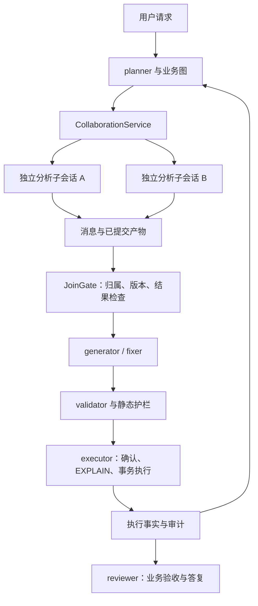

# 参考 DeepSeek-Harness 源码的多智能体协作完善方案

更新日期：2026-10-07。

本文围绕 **DeepSeek-Harness 的实际源码实现 → sql-agent 当前差距 → 可以引入的方案** 展开。重点是协作运行机制，不要求把 sql-agent 改写为 TypeScript，也不要求接入整套 Harness。

源码基线与核对边界：

- sql-agent：本地仓库提交 `6c932ff33c1b2f437b719e2bbbf24cba2cec369b`，核对 `app/graph.py / agents.py / state.py / runtime.py / router.py` 等实现。
- DeepSeek-Harness：通过官方 GitHub Raw 源码页面核对 `master` 的 TypeScript 实现，文内链接定位到实际文件、类、方法和行区间，不以 README 作为实现证据。
- 网络未能完成源码克隆，也未获取到可固定的 commit SHA；网页缓存时间可能不同，因此这是源码级静态分析，不是同一提交快照上的完整调用验证。实施时应锁定 commit 后复核。
- 未运行 Harness、未运行双方集成测试。下文“建议增加”的文件、字段与接口均是 sql-agent 的改造建议。

## 1. 源码中的协作方案是什么

sql-agent 目前主要通过 **共享 TaskState + 六个角色节点 + router** 协作。DeepSeek-Harness 的相关源码则把协作拆为 **委派工具、子 Agent 服务、执行 provider、独立子会话、活动实例与消息控制**。

这两者对应的是不同的组织方式：前者强调角色间移交当前任务状态；后者还管理独立子任务的运行、继续对话、返回结果和资源释放。

### 1.1 关键源码地图

以下路径均相对于 DeepSeek-Harness 仓库根目录；链接在后续章节给出。

| 源码路径 | 核对的符号 | 协作职责 |
| --- | --- | --- |
| `packages/subagent/tool-subagent/src/index.ts` | `apply`、`resolveDelegationRun`、`settleForegroundRun` | 模型委派工具与三类执行分支 |
| `packages/subagent/subagent/src/index.ts` | `SubagentRuntime.start / startContinuable / sendMessage` | 统一委派入口与 provider 注册 |
| `packages/subagent/subagent-spawn-in-process/src/index.ts` | `SpawnInProcessProvider` | 无父对话历史的新子 Agent |
| `packages/subagent/subagent-fork-in-process/src/index.ts` | `completedTurnPrefix`、`ForkInProcessProvider` | 从父已完成轮次创建子上下文 |
| `packages/subagent/subagent-in-process-driver/src/index.ts` | `startInProcessRun`、`drivePublishedRun`、`readResult` | 一次性子任务驱动与结果读取 |
| `packages/subagent/subagent-in-process-driver/src/structured.ts` | `attachStructuredRuntime` | 子 Agent 范围内的结构化结果提交 |
| `packages/subagent/subagent/src/continuation.ts` | `SubagentContinuationManager` | 子会话创建、消息投递和冷恢复 |
| `packages/subagent/subagent/src/continuation-activation.ts` | `ContinuableActivationRegistry` | 并发准入、归属、结束判定和释放 |
| `packages/subagent/subagent/src/inbox.ts` | `SubagentInbox` | Queue/Steer 入口与关闭边界 |
| `packages/subagent/subagent/src/continuation-messages.ts` | `createAgentMessage / createSettlementMessage` | Agent 消息与运行时结束通知 |
| `packages/subagent/subagent/src/descriptor.ts` | `snapshotSubagentDescriptor / foldSubagentDescriptor` | 持久身份与恢复配置 |
| `packages/subagent/subagent/src/catalog.ts` | `establishCatalogChild` | 父会话记录子 Agent 目录 |
| `packages/subagent/subagent/src/list-children.ts` | `listChildren / listDescendants` | 持久任务树发现 |
| `packages/subagent/subagent/src/child-agent.ts` | `resolveChildDepth / applyChildComposition` | 深度、模型与权限组合 |
| `packages/workflow/workflow-ptc/src/index.ts` | `PtcWorkflowEngine.start` | 编排启动前检查与资源限制 |
| `packages/workflow/workflow-ptc/src/host.ts` | `PtcWorkflowRun`、`startChild`、`childResult` | 编排脚本与子任务控制桥接 |

### 1.2 两条主要执行链

一次性委派的源码调用关系：

```text
委派工具 execute
  → SubagentRuntime.start(provider, request)
  → provider.start(request)
  → startInProcessRun
  → agents.create + 子 Agent setup
  → child.followup
  → child.whenIdle
  → readResult
  → 调用者收集结果并 dispose
```

可继续子会话的源码调用关系：

```text
委派工具 execute（continuable 后台分支）
  → SubagentRuntime.startContinuable
  → SubagentContinuationManager.startContinuable
  → provider.prepareContinuable（只准备初始创建数据）
  → activations.materialize
  → 提交初始消息，返回 childId / messageId

后续 send_message
  → SubagentRuntime.sendMessage
  → continuation.sendMessage
  → 校验父子关系
  → 活动实例存在：投递到其 inbox
  → 活动实例不存在：coldResume → agents.resume → 投递
```

对应源码：[工具分支](https://github.com/deepseek-ai/deepseek-harness/blob/master/packages/subagent/tool-subagent/src/index.ts#L453-L546)、[一次性驱动](https://github.com/deepseek-ai/deepseek-harness/blob/master/packages/subagent/subagent-in-process-driver/src/index.ts#L98-L196)、[continuation 创建与投递](https://github.com/deepseek-ai/deepseek-harness/blob/master/packages/subagent/subagent/src/continuation.ts#L98-L224)。

**对 sql-agent 的核心建议：保留现有业务图，在它旁边增加子任务协作运行层。** 由图判断何时委派、何时执行 SQL；协作层负责子会话、消息、产物和生命周期。

## 2. 借鉴一：区分前台一次性、后台 Job、可继续子会话

### 源码实际做法

`tool-subagent` 的 `execute` 有三类分支：前台调用 `start` 后收集并释放；后台 one-shot 交给 `jobs.start`；后台 continuable 调用 `startContinuable`，返回可继续使用的子 Agent ID。`resolveDelegationRun` 还区分两种后台模式的默认行为。[源码：调度选择与执行分支](https://github.com/deepseek-ai/deepseek-harness/blob/master/packages/subagent/tool-subagent/src/index.ts#L273-L290)

### sql-agent 可以引入什么

当前角色调用基本是“执行一个节点，返回状态增量”。可以增加显式 `execution_mode`：

| 模式 | sql-agent 的适用场景 | 返回什么 | 后续操作 |
| --- | --- | --- | --- |
| foreground | 校验当前草稿，下一步立即依赖结果 | 最终产物和运行结果 | 汇合后释放 |
| background_job | 独立评估另一个查询方案 | job_id | 查询/收集 Job 结果 |
| continuable | 长 SQL 分析、需要多轮补充的修正 | child_session_id、message_id | 发送新证据，继续同一会话 |

不要把所有角色都常驻化。短任务继续沿用现有节点；只有独立工作或多轮分析才创建子会话。

**落点：** 建议新增 `app/collaboration/service.py`，定义三类返回值；在 `graph.py` 的分析分支调用协作服务。人工确认仍走现有执行器，不能因子任务后台完成就自动执行 SQL。

**验收：** 返回 accepted/job_id 不计作业务完成；父任务能找到子任务；后台失败不会因为已有输出而被汇总为成功。

## 3. 借鉴二：用统一服务协调 provider，工具保持轻薄

### 源码实际做法

`SubagentRuntime` 使用命名 provider 注册表；`start` 在调用 provider 前检查能力、深度与输出 schema。创建后的本地子会话登记到父 catalog，登记失败会释放子任务。工具调用与 provider 实现分开。[源码：registerProvider 与 start](https://github.com/deepseek-ai/deepseek-harness/blob/master/packages/subagent/subagent/src/index.ts#L490-L564)

### sql-agent 可以引入什么

现在 `agents.py` 同时承载提示词组织、模型调用、账本和业务行为，直接增加更多委派分支会使这份文件继续膨胀。

建议分出三个接口层：

```text
业务编排：决定任务目标、依赖与执行边界
    ↓
CollaborationService：验证请求、跟踪身份、统一生命周期
    ↓
AgentProvider：运行角色并返回产物
```

先实现 `InProcessProvider`，复用已有 `_call` 与 Pydantic schema。外部进程 provider 属于后续选项，不是第一步必要条件。

请求建议携带：`run_id / task_id / parent_session_id / role / prompt / output_schema / allowed_scope / plan_version`。能力声明至少区分结构化输出、继续会话、工具过滤与取消支持。不支持的要求启动前报错，不能静默忽略。

**落点：** `service.py`、`providers.py`；`runtime.py` 持有服务；`state.py` 定义请求结果契约。

**验收：** 换 provider 后输出契约不变；创建失败不遗留 running 任务；角色工具不自行实现第二套消息和恢复逻辑。

## 4. 借鉴三：spawn/fork 的区别落实在历史边界

### 源码实际做法

spawn provider 调用共享驱动时不传 seed，`inheritsParentContext=false`。fork 的 `completedTurnPrefix` 查找最后一个 `turn/end`，只复制截至该事件的历史；当前未结束轮次不进入子会话。continuable fork 只在首次创建时取一次 seed。[源码：spawn](https://github.com/deepseek-ai/deepseek-harness/blob/master/packages/subagent/subagent-spawn-in-process/src/index.ts#L37-L58)、[源码：completedTurnPrefix 与 fork](https://github.com/deepseek-ai/deepseek-harness/blob/master/packages/subagent/subagent-fork-in-process/src/index.ts#L43-L83)

### sql-agent 可以引入什么

当前 `prior_turns` 和 `_handoff` 是按角色组织摘要与证据，已经具备上下文裁剪价值。可以进一步把上下文策略变成契约：

- `fresh`：SQL 候选生成、独立审查。必须提供完整任务、相关目录和来源引用。
- `completed_history`：强依赖前文的分析。仅继承已完成的对话与已提交产物。
- `explicit_evidence`：修正 SQL。只传当前任务的草稿、真实错误、表范围和相关依赖结果。

这三个名字是本项目建议；第三种是针对 SQL 业务的扩展，不是声称 Harness 存在同名 provider。

不要直接复制整个 TaskState。它包含执行状态、确认标记和失败记录；将这些当作新子任务自身状态会产生身份与权限混淆。

**落点：** 建议新增 `context_builder.py`，围绕 `agents._handoff` 和 `graph._prior_turns` 复用；上下文记录继承边界和来源版本。

**验收：** 子会话看不到父当前未完成轮次；fork 后父产生的新内容需显式传递；继承业务历史不继承“已确认当前动作”的权限。

## 5. 借鉴四：稳定子会话与临时活动实例分开

### 源码实际做法

`continuation.startContinuable` 分配 childId、保存 descriptor、准备创建数据，然后 materialize 并提交消息。`coldResume` 从子会话自身的 descriptor 重建配置，不再调用 provider 重新 fork 父历史。[源码：创建](https://github.com/deepseek-ai/deepseek-harness/blob/master/packages/subagent/subagent/src/continuation.ts#L98-L179)、[源码：coldResume](https://github.com/deepseek-ai/deepseek-harness/blob/master/packages/subagent/subagent/src/continuation.ts#L387-L435)

`descriptor.ts` 用显式、版本化字段保存 mode、provider、模型、persona 和 toolFilter；不持久化整个可扩展 AgentOptions，也不保存 outputSchema、maxTokens 等活动参数。[源码：descriptor 字段与版本](https://github.com/deepseek-ai/deepseek-harness/blob/master/packages/subagent/subagent/src/descriptor.ts#L1-L83)

### sql-agent 可以引入什么

建议区分三种 ID：

| ID | 表达什么 | 为什么不能混用 |
| --- | --- | --- |
| task_id | 业务子目标，例如补货 | 一项业务任务可能由多个角色处理 |
| agent_session_id | 独立分析上下文 | 可跨多次消息与运行继续使用 |
| activation_id / attempt_id | 当前运行实例与尝试 | 崩溃、恢复或重试后应变化 |

当前 `agent_task` 使用角色、轮次、游标生成执行记录，`agent_id=role`；它不能直接表示多个同时存在的 generator 子会话。

恢复描述建议保存角色、上下文策略、父会话、模型配置、工具范围和 schema_version。SQL 业务还需单独保存 plan_version、动作版本与权限范围，但不要把瞬时模型对象、连接或完整 Runtime 序列化。

预算不能只靠恢复描述。应按全局任务累计计费，并在每次恢复时重新检查剩余预算，避免冷恢复重置额度。

**落点：** 新增 `agent_session` 与 `agent_activation` 账本实体，关联原 `agent_task`；现有 LangGraph checkpoint 继续恢复业务图，子会话存储恢复分析上下文。

**验收：** 同一 child_session_id 能继续讨论；新 activation 不重复执行旧 SQL；恢复后沿用合法范围，并拒绝未知描述版本。

## 6. 借鉴五：消息由运行时归属，接收不等于处理完成

### 源码实际做法

控制工具从 `exec.agent` 取得 sender，调用服务而不自己路由；`sendMessage` 检查 sender 必须是当前 live 对象，并按直接父子关系投递。`createAgentMessage` 写入运行时生成的发送者来源。[源码：控制工具](https://github.com/deepseek-ai/deepseek-harness/blob/master/packages/subagent/tool-subagent-control/src/index.ts#L25-L68)、[源码：身份与关系检查](https://github.com/deepseek-ai/deepseek-harness/blob/master/packages/subagent/subagent/src/continuation.ts#L195-L224)、[源码：消息归属](https://github.com/deepseek-ai/deepseek-harness/blob/master/packages/subagent/subagent/src/continuation-messages.ts#L43-L68)

`SubagentInbox` 没有再造业务执行队列，而是把 queue/steer 分别交给 Agent.followup/steer；关闭开始后拒绝接收新消息。[源码：SubagentInbox](https://github.com/deepseek-ai/deepseek-harness/blob/master/packages/subagent/subagent/src/inbox.ts#L14-L64)

### sql-agent 可以引入什么

当前 EventBus 的 Queue 用于 SSE 订阅，是展示事件通道。它不能直接当 Agent inbox，因为订阅者慢时 `publish` 会丢事件，且没有任务认领语义。

新增受控消息入口，消息字段建议为：

```text
message_id, run_id, sender_session_id, recipient_session_id,
task_id, plan_version, source_kind, payload, evidence_refs
```

发送者由服务认证并写入；模型只能提供目标与内容。兄弟 Agent 可经主控转发证据，先避免任意网状通信。

建议区分：`queue` 为下一轮新任务；`steer` 为正在运行任务的补充约束。返回 message_id 只代表接收。处理状态与产物状态另行跟踪。

消息传递分析、错误与证据引用；确认必须来自用户身份与动作凭据。即使消息文字声称“用户同意”，也不能解除 executor 的确认门禁。

**落点：** 新增 `messages.py`；协作服务拥有投递逻辑；原 `EventBus` 保留作展示。

**验收：** 伪造 sender 无效；跨 run 投递被拒绝；关闭中的子会话不能吞消息；重复消息不产生重复业务动作。

## 7. 借鉴六：结束判定要覆盖子任务与未处理消息

### 源码实际做法

`ContinuableActivationRegistry` 在建立子任务前登记 ownership；`watchSettlement` 等待 Agent idle 后，在锁内重新检查待处理 inbox、ownedChildren 与观察代次，再决定释放。结束通知先于归属释放。最终 flush 失败只记警告，不能据此推断持久化必然成功。[源码：归属建立](https://github.com/deepseek-ai/deepseek-harness/blob/master/packages/subagent/subagent/src/continuation-activation.ts#L243-L262)、[源码：结束判定与释放](https://github.com/deepseek-ai/deepseek-harness/blob/master/packages/subagent/subagent/src/continuation-activation.ts#L686-L854)

### sql-agent 可以引入什么

目前游标达到 intents 长度就进入 reviewer。引入后台子 Agent 后，仅检查 cursor 不够，需要汇合条件：

```text
计划中的必要任务均有终态
且无必要子任务仍运行或创建中
且无未处理的相关消息
且已提交产物版本匹配
且业务验收通过
```

建议由协作服务维护 parent-child 归属，并在 reviewer 前设置 JoinGate。父会话活动是否 idle 与用户目标是否完成要分别记录。

这是并行协作中很值得借鉴的机制：父任务创建子任务时就登记归属，不能等子任务启动完再登记，否则父可能在异步间隙提前结束。

进程内锁只能协调当前进程；如果部署多 worker，必须再用账本 CAS、唯一活动认领和 fencing 等持久机制。不能将 Harness 的进程内活动注册表当作分布式数据库写入保证。

**落点：** `service.py` 的 ownership 和 JoinGate；`graph.py` 在进入 reviewer 前检查；`ledger.py` 保存必要子任务终态与结果引用。

**验收：** 子任务创建中的窗口不会使父提前收尾；晚到消息能触发复核；审查时缺失产物会明确失败或等待。

## 8. 借鉴七：中断当前轮次与释放任务树分开

### 源码实际做法

`interrupt` 对 live 目标调用 `cancel(..., {keepInbox:true})`；它请求停止当前活动，不等待停止完成。`drain` 则关闭准入、等待创建中的工作，并按子级先于父级释放。两者不能混作一个 cancel API。[源码：interrupt 与 drain](https://github.com/deepseek-ai/deepseek-harness/blob/master/packages/subagent/subagent/src/continuation-activation.ts#L269-L389)

### sql-agent 可以引入什么

建议明确两种控制：

- `interrupt_analysis`：停止当前分析轮次，保留子会话，允许之后补充证据继续。
- `cancel_run`：停止整个用户任务，禁止新子任务启动，取消在途分析并等待资源释放。

取消 SQL 执行还需数据库驱动配合；取消请求的接收不是数据库事务已经回滚。已提交的写操作不能被 Agent 取消机制撤销，必须保留审计并展示部分完成。

当前 `server.py` 的后台 `asyncio.create_task` 需要任务注册和控制句柄，才能实施上述 API。前端状态可区分 cancelling 与 cancelled。

**验收：** interrupt 后还能继续同一分析；cancel_run 不再创建子孙任务；已提交操作不会被隐藏；多次取消共享一次清理过程。

## 9. 借鉴八：结构化产物必须经过权威提交

### 源码实际做法

`attachStructuredRuntime` 在子 Agent 范围内注册结构化工具；参数校验后先暂存，只有权威 `tools/result` 成功才捕获。嵌套调用还等待外层结果。一次性驱动在缺失所要求的结构化捕获时不报告正常完成。[源码：结构化捕获](https://github.com/deepseek-ai/deepseek-harness/blob/master/packages/subagent/subagent-in-process-driver/src/structured.ts#L44-L120)、[源码：readResult](https://github.com/deepseek-ai/deepseek-harness/blob/master/packages/subagent/subagent-in-process-driver/src/index.ts#L198-L224)

### sql-agent 可以引入什么

现有 Pydantic 输出契约值得保留。若增加多步子 Agent，应该定义“最终产物提交”而不从聊天尾句或展示事件提取 SQL。

建议产物状态：`candidate → schema_validated → committed → consumed`。提交携带 task_id、plan_version、artifact_version、source_refs；主控只消费 committed 产物。

多候选 SQL 由汇合节点选择一个候选，再经过本项目 validator/executor。子 Agent 的 structured success 只表示产物格式有效，不证明 SQL 安全或业务完成。

当前 `state_delta` 为可观测展示而裁剪，不能当完整可恢复产物。完整 SQL、结果和依赖应保存到独立产物记录，事件只引用产物。

**落点：** `artifacts.py` 与 `ledger.py`；保留 `state.py` 契约；汇合节点负责单次消费与版本校验。

**验收：** schema 校验失败、提交失败或旧版本产物均不能进入执行；两个子 Agent 的结构化结果互不覆盖。

## 10. 借鉴九：父目录、子描述与运行通知各有职责

### 源码实际做法

`catalog.ts` 在父会话写 `subagent/catalog`，投影跳过继承历史中的目录事件。`listChildren/listDescendants` 从这些目录发现任务，遍历用 visited 防重复，活动存在与否单独标记。[源码：catalog 投影](https://github.com/deepseek-ai/deepseek-harness/blob/master/packages/subagent/subagent/src/catalog.ts#L116-L155)、[源码：目录遍历](https://github.com/deepseek-ai/deepseek-harness/blob/master/packages/subagent/subagent/src/list-children.ts#L28-L121)

结束消息使用独立 `subagent-settled` 来源，与子 Agent 自行发送的 `agent-message` 分开。[源码：运行时通知](https://github.com/deepseek-ai/deepseek-harness/blob/master/packages/subagent/subagent/src/continuation-messages.ts#L127-L151)

### sql-agent 可以引入什么

父任务保存“我创建了谁”；子会话保存“我是谁、如何恢复”；运行时保存“这次活动怎样结束”；业务审查保存“任务是否达成”。不要用一张任务表的 status 表达全部语义。

前端增加任务树：角色、目标、父任务、依赖、运行活动、结果状态和产物引用。inactive 不能显示成 succeeded；某个子目录损坏应显示诊断，不能默默消失。

建议区分三种来源：模型建议、执行器事实、运行时状态。子 Agent 的结论进入候选层，数据库真实结果才进入执行事实层。

**落点：** `ledger.py` 的父子关系与来源字段；`server.py` 提供树形查询；`web/index.html` 展示任务树和来源。

**验收：** 子会话停止驻留后仍可发现；复制上下文不会把父已创建的所有子 Agent 变成新子会话的孩子；失败通知不能冒充业务执行结果。

## 11. 借鉴十：深度、能力和权限在创建边界确定

### 源码实际做法

`child-agent.ts` 集中计算子深度、模型配置与子作用域；深度使用父持久元数据，工具过滤在子 scope 生效。委派时同步捕获权限覆盖，审批策略固定为 never。模型路由改变时，未显式指定的 reasoningEffort 不盲目继承。[源码：深度与模型](https://github.com/deepseek-ai/deepseek-harness/blob/master/packages/subagent/subagent/src/child-agent.ts#L46-L114)、[源码：子能力与权限](https://github.com/deepseek-ai/deepseek-harness/blob/master/packages/subagent/subagent/src/child-agent.ts#L190-L266)

### sql-agent 可以引入什么

角色权限建议配置化：generator 只能读目录与提交草稿；validator 只能审查；fixer 只能在已选表范围内提交修订；executor 服务持有数据库连接。

现有 Runtime 把 db 作为统一属性传给节点，当前靠函数约定控制数据库使用。可以提供角色专用能力视图，从接口层减少误调用，而不只在提示词中写“不要查库”。

创建子 Agent 时固定权限，禁止子 Agent 自行扩大表范围或绕过确认。若遇到需要更大权限的任务，返回 escalation_required 给主控处理。不要把 Harness 的 never 审批直接替代本项目人工确认：它解决委派子 Agent 的权限升级，而 SQL 确认仍绑定具体 SQL 和用户。

同时限制最大委派深度、并发数、总子任务数和累计调用预算。并发池不是预算池，两者需分别计量。

**落点：** `role_spec.py`、角色能力对象；`config.py` 加协作上限；`llm_call` 增加父子成本归属。

**验收：** 子 Agent 无法访问业务连接；恢复后深度不归零；换模型不继承不兼容配置；所有分支费用纳入 run 总额。

## 12. 借鉴十一：编排与子任务控制由宿主托管

### 源码实际做法

`PtcWorkflowEngine.start` 在发布运行前检查 meta、脚本语法、provider 和子任务总量；配置还提供并发、items 和同步执行时限。`PtcWorkflowRun` 将 startChild/childResult/disposeChild 暴露为宿主绑定，并持有子运行与取消控制。[源码：workflow 启动限制](https://github.com/deepseek-ai/deepseek-harness/blob/master/packages/workflow/workflow-ptc/src/index.ts#L121-L174)、[源码：宿主控制桥接](https://github.com/deepseek-ai/deepseek-harness/blob/master/packages/workflow/workflow-ptc/src/host.ts#L102-L219)

workflow 服务对致命基础设施错误与普通子任务失败分开处理，并定义生命周期事件；phase 是进度分组，没有执行依赖语义。[源码：workflow 错误与事件](https://github.com/deepseek-ai/deepseek-harness/blob/master/packages/workflow/workflow/src/index.ts#L33-L138)

这里不将其解释成已具备 SQL 业务的持久 DAG 调度器。本次未核对到 guest helpers 的完整实现，不推断其全部 parallel/pipeline 算法。

### sql-agent 可以引入什么

第一阶段借鉴宿主管控的并行编排：让运行时发起独立分析、等待汇合、检查版本与必要任务结果。先不开放模型任意脚本执行。

最适合的首个试点是 **同一复杂 SQL 的多角度只读审查**：意图覆盖、关联/过滤逻辑、风险评估并行分析；主控汇总意见，再进入现有 validator。另一个试点是并行生成两个查询方案，选中一个后才执行。

后续按 `QueryIntent.depends_on` 构建受控 DAG；这是针对项目提出的调度器设计，不能归因于已读取的 Harness 代码。

必须把 TaskState 中的单个 draft/checks/result 拆成按 task_id 隔离的产物。不能对现在的共享状态直接加 `asyncio.gather`，否则多分支会争用同一个草稿与游标。

**落点：** `scheduler.py` 与 JoinGate；`state.py` 增加任务映射；`graph.py` 增加分析 fan-out/fan-in。数据库写操作仍由 executor 串行承接。

**验收：** 分析并行不覆盖产物；必需分支失败不能悄悄忽略；展示 phase 不充当依赖；整个任务取消后等待在途子任务清理。

## 13. 推荐的 sql-agent 目标结构

以下是本项目的改造建议，不是对 Harness 源码目录的复刻。

```text
app/
  graph.py                 业务图、护栏、人工确认与执行路径
  agents.py                原有角色实现，逐步减轻运行管理职责
  collaboration/
    service.py             委派、消息、发现与 JoinGate
    providers.py           进程内角色运行适配
    role_spec.py           模型配置、工具范围与预算
    context_builder.py     fresh / 完成历史 / 显式证据
    messages.py            消息身份、投递与处理记录
    sessions.py            子会话与 activation 管理
    artifacts.py           结构化产物提交及版本校验
    scheduler.py           受控独立任务与依赖调度
  ledger.py                会话、父子关系、消息与产物持久化
  router.py                保留业务安全路径裁决
```



## 14. 优先级与最小实施顺序

| 顺序 | 引入机制 | 解决的具体问题 | 首个交付 |
| --- | --- | --- | --- |
| 1 | 统一委派服务、独立上下文、结果契约 | 扩展角色时运行逻辑混杂、上下文污染 | 进程内一次性只读子任务 |
| 2 | 产物版本与提交、父目录、运行终态 | 输出覆盖、任务失联、部分输出误判成功 | 可追溯的子任务和结果列表 |
| 3 | 宿主并发准入与 JoinGate | 父提前结束、无限创建子任务 | 并行只读审查 |
| 4 | 子会话与消息 inbox、冷恢复 | 多轮分析需要反复从头开始 | 可继续的复杂 SQL 分析会话 |
| 5 | 中断与树级释放、恢复对账 | 取消语义含糊、资源残留 | 可验证的停止与恢复流程 |
| 6 | 可选外部 provider 或受控脚本 | 确有跨进程/脚本需求 | 固定版本的小范围试点 |

写 SQL 副作用可靠性是上述扩展的前提：重复 start/confirm 要原子认领；确认绑定 SQL 哈希和版本；业务库提交后账本失败要能对账；样本结果不能代表完整修改范围。这些属于 sql-agent 自身需要补齐的业务能力，Harness 的子 Agent 管理不会自动提供数据库 exactly-once。

## 15. 建议用这些场景验证借鉴是否有效

1. fresh 子任务只看到明确传入的证据；fork 不包含父当前未结束轮次。
2. 返回 child_id/message_id 后子任务仍在运行，主控不会显示已完成。
3. 子 Agent 不能伪造用户确认或跨任务发送消息。
4. 结果必须 schema_validated 且 committed；自然语言“完成”不算提交。
5. 子任务创建、投递与释放并发发生时，不丢消息、不提前结束父任务。
6. interrupt 仅停止当前分析；cancel_run 关闭新准入并释放任务树。
7. 子会话恢复后仍有原身份、工具范围和委派深度，累计预算不重置。
8. 两个分析分支产物分离，旧计划结果不能覆盖新计划。
9. inactive、aborted、refusal、partial 与 succeeded 分别展示。
10. 重复执行请求、SQL 提交后崩溃和截断结果场景不造成重复或遗漏写操作。

最值得从源码引入的是：**委派服务与工具分层、独立子上下文、会话/活动分离、可信消息来源、完整的结束与释放条件、结构化产物提交，以及宿主管控的并行协作**。对于 sql-agent，先把这些机制用于只读分析与草稿审查，最容易验证收益，也最容易保留现有 SQL 执行边界。
