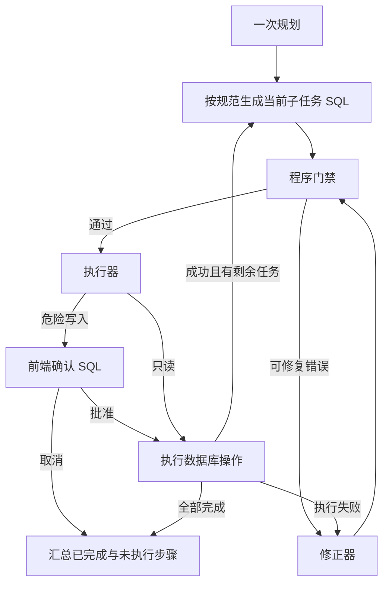

# SQL 生成规范与流程精简

本轮针对实际会话中的冗余模型调用、删除 SQL 尚未展示就被“未确认”否决，以及 COUNT 查询被误报为可能截断的问题改造。

## 默认链路

禁止操作仍由硬门禁拒绝；图中修正分支不代表放宽权限。SQL 哈希、确认版本、只读事务和取消终态等第一阶段措施继续有效。

## 规范前移

生成器与修正器共用 SQL 规范：单个顶层操作、不使用写入 CTE；删除直接生成 DELETE 并通过执行结果获知影响行数；仅在确需返回字段时使用 RETURNING；明细查询使用明确字段和 LIMIT，标量聚合不强加 LIMIT；内置函数绑定 pg_catalog。

COUNT 只是数量，不能伪装成一组已确认的订单 ID。按状态删除时保留用户原始条件；若用户要求固定第一次统计时的对象集合，则应先取得完整 ID 证据。人工确认由执行器暂停并展示当前 SQL，生成器不应因为尚未确认而拒绝生成，语义复核也不应提前否决它。

## 减少调用

- 小目录（默认不超过 20 张表）直接提供目录生成 SQL，省去单独模型选表。
- `SEMANTIC_REVIEW=false`：校验只运行程序门禁；复杂任务可以配置开启模型语义复核。
- `REPLAN_AFTER_SUCCESS=false`：成功后直接进入下一子任务，保留失败时的修正与重新规划路径。
- 执行器只记录真实数据库结果，不再调用模型逐步点评；最终汇总仍由审查器生成。

这些设置来自 `app/config.py`。旧文档里逐步复查、每步模型校验与执行点评的示例属于历史行为，以本文件为准。模型规范能减少错误生成，程序门禁继续承担防逃逸兜底；关闭语义复核后，程序检查并不能证明 SQL 完全符合自然语言需求。

## 验证

2026-10-08 离线检查：check_flow 6 项、check_reliability 28 项，以及 check_router、check_guard、check_prompts、check_export、check_usage、check_js 全部通过。

完整图回归复现“先统计已取消订单、删除前确认、删除成功后查询剩余数量”：删除前进入真实 LangGraph interrupt，取消后不执行 DELETE、不执行剩余数量查询。此路径的模型调用为一次规划、两次生成和最终汇总；校验、执行和逐步复查没有模型调用。

本轮没有连接真实业务数据库或真实模型。提示词在实际模型上的遵循效果仍需用原问题验收，不能把离线替身结果当作真实模型生成质量已经得到证明。按状态删除与第一次统计之间可能发生并发变化，当前实现不承诺统计数量就是最终删除数量。
