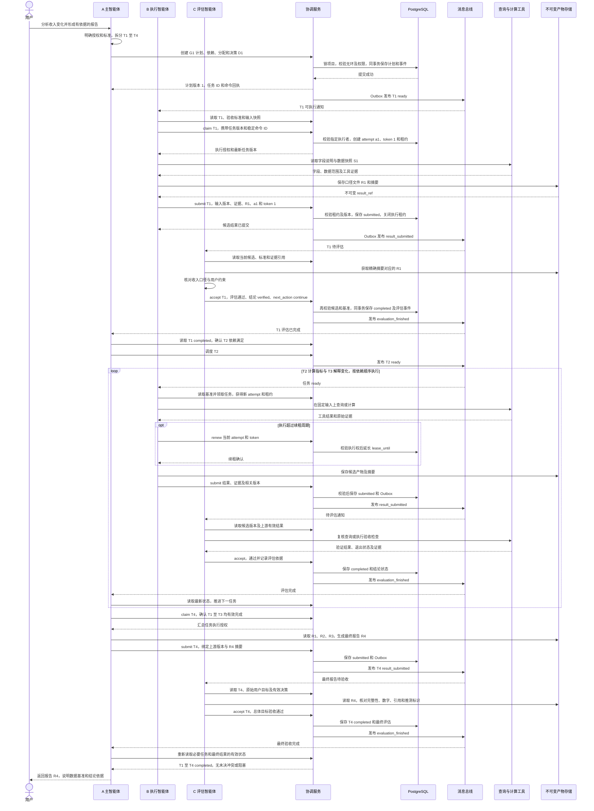
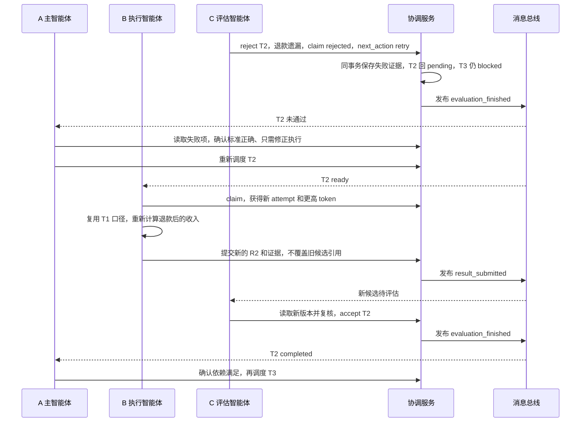
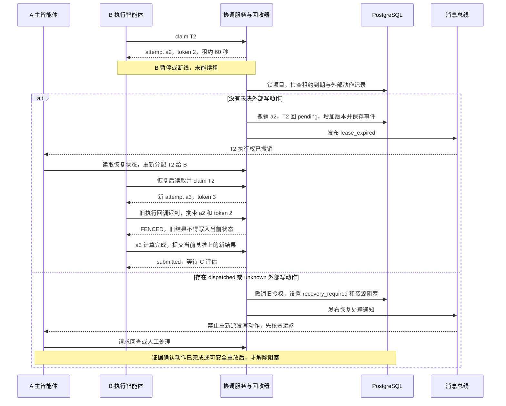
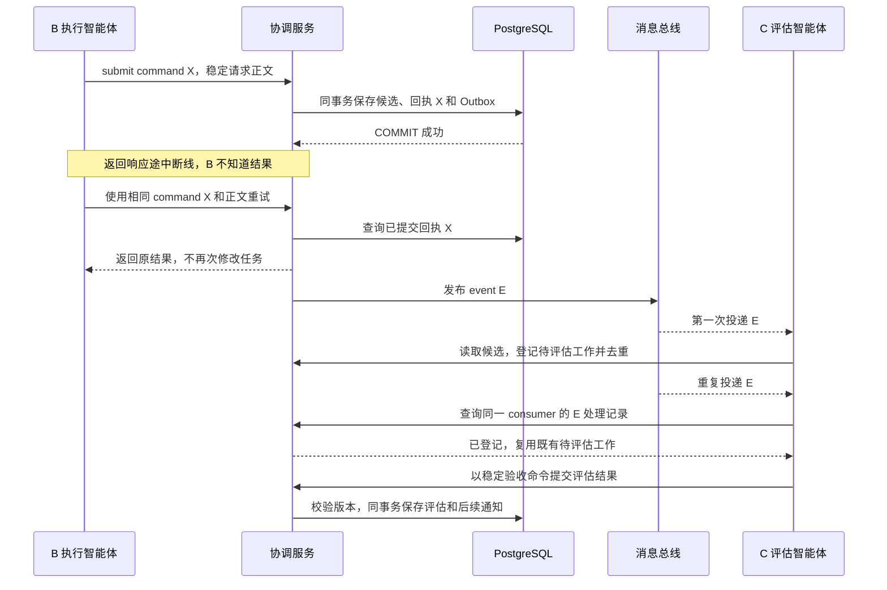

# 三个智能体完整运行流程预览

最后修改时间：2026-10-08 17:33:37（北京时间，UTC+08:00）

本预览模拟三个智能体完成一次用户请求的全过程。使用 Mermaid 时序图表示消息、状态提交与等待关系，所有名称、时间和数据均为演示设定。本文独立阅读，不依赖其他设计文档。

## 1 模拟场景与角色

用户请求：“分析 9 月订单收入，解释相较 8 月的变化，输出带数据依据的报告。”

授权边界：只读订单数据，可以生成报告，不修改业务数据库、不自动发送报告。验收要求：统一人民币口径、排除取消订单、明确退款处理、引用查询与数据快照；结论必须与计算结果一致。

三个智能体分别为：

| 智能体 | 职责 | 本次产出 |
| --- | --- | --- |
| A 主智能体 | 理解用户目标、规划子任务、分配执行、处理反馈、整合报告 | 计划、有效决策、最终报告 |
| B 执行智能体 | 读取任务和输入，调用查询及计算工具，提交候选结果 | 数据口径说明、指标文件、解释草稿 |
| C 评估智能体 | 核对原始证据及具体版本，执行验收，决定通过或退回 | 结构化评估与总体报告验收 |

协调 API、PostgreSQL、消息总线、工具和产物存储是基础设施，不是额外智能体。租约回收和通知派发由协调服务的后台任务执行。

本次只有一个执行智能体，因此子任务由 B 依次执行，A 和 C 同时承担调度与审核职责。三个角色形成流水线，不把“有三个智能体”误解为三个子任务必须并行。

## 2 子任务与共享记录

全局请求为 G1，项目为 P1；初始计划版本为 1，有效决策为 D1。

| 任务 | 输入与依赖 | 输出 | 验收重点 |
| --- | --- | --- | --- |
| T1 确定收入口径 | 用户约束、订单字段说明，无前置任务 | 口径文件 R1 | 取消订单排除、退款规则和时间范围明确 |
| T2 计算指标 | T1 completed、同一数据快照 S1 | 指标文件 R2 | 月收入、环比及查询证据可复核 |
| T3 解释变化 | T2 completed、R1 和 R2 | 解释草稿 R3 | 原因有证据，推测单独标识 |
| T4 最终整合 | T1、T2、T3 completed | 报告 R4，由 A 执行 | 总体目标完整、结论一致、引用齐全 |

T4 的执行者为 A，评估者仍为 C。A 对自身汇总结果不能直接宣布完成。

交接对象包含 global_task_id、task_id、attempt_id、输入快照、证据引用、假设、已排除方向、权限、结果引用和验收规则。所有产物引用指向不可变内容，并带内容摘要。

任务工作流为 pending → running → submitted → completed。结论另标记 candidate、verified、conflict 或 rejected。未通过或需要人工处理时不允许下游领取。

## 3 正常运行的完整时序

图中的“同事务”步骤同时保存共享状态、命令回执和 Outbox 事件。总线至少一次交付；接收者读取当前状态后行动，不直接依据通知正文宣布完成。

## 4 同一次运行中的验收返工

假设 T2 的第一份产物未扣除退款。C 否决后，T3 仍未就绪；A 安排 B 修正 T2，不重做已通过的 T1。

如果 C 发现原标准本身有歧义，则返回 change_route、narrow_scope 或 human_required，设置 dispatch_block。A 明确处理并批准变更后才解除阻塞；不能通过反复重试绕过问题。

## 5 租约到期与迟到结果

仍然只有 A、B、C 三个智能体。这里模拟 B 的旧运行失联，再由 B 恢复后的新执行尝试接管；attempt 变化不等于增加智能体数量。C 始终负责评估，不临时充当执行者。

本场景只读业务数据，正常情况下进入第一分支。第二分支说明如果以后增加报告发送或业务写操作，接管不能仅依据租约到期；旧远端请求可能仍在执行。

## 6 通知重复与提交响应丢失

command_id 防止数据库命令重复生效，event_id 防止通知重复处理。它们均不能替代外部业务动作的幂等键。

登记待评估工作与 inbox 去重必须共同持久化，不能先标记消息已处理、再启动尚未记录的工作。评估调用失败时恢复这一待评估步骤；协调服务周期扫描 submitted 任务作为通知恢复保障。

## 7 运行结束时应看到什么

| 检查项 | 本次成功结束的状态 |
| --- | --- |
| 用户目标 | 原始要求及授权边界可查 |
| 任务图 | T1 → T2 → T3，T1、T2、T3 → T4，依赖无环 |
| 任务状态 | 必要任务全部 completed，且当前依据仍有效 |
| 产物 | R1 至 R4 有不可变引用、摘要和输入基准 |
| 评估 | 每项评估绑定精确候选版本，保留验证证据 |
| 结论 | 必要结论 verified，推测显式标识，无未决 conflict |
| 执行权 | 已提交任务无活动执行租约，旧 attempt 不能再提交 |
| 恢复事项 | 无 recovery_required、human_required 或未确认写动作 |
| 最终答复 | A 返回经过 C 总体验收的 R4，而非拼接未验证草稿 |

该预览的关键是：A 决定工作如何推进，B 产生候选结果，C 检查是否达到标准；共享服务记录与校验事实，租约限制执行权，消息总线提醒各层继续工作。三者可以异步运行，但有效状态只能通过统一提交协议改变。
