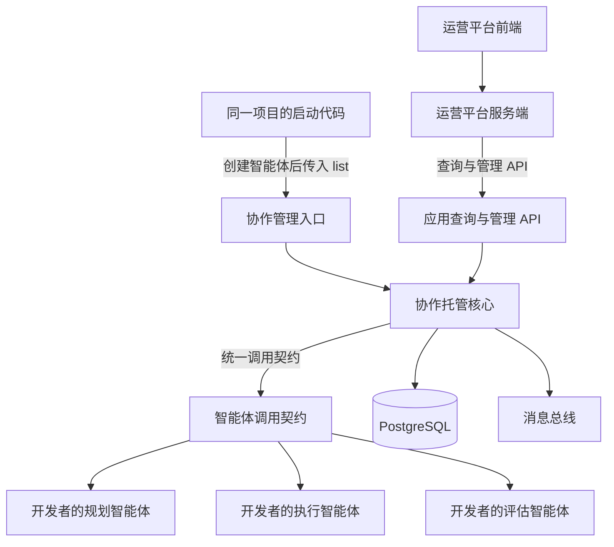
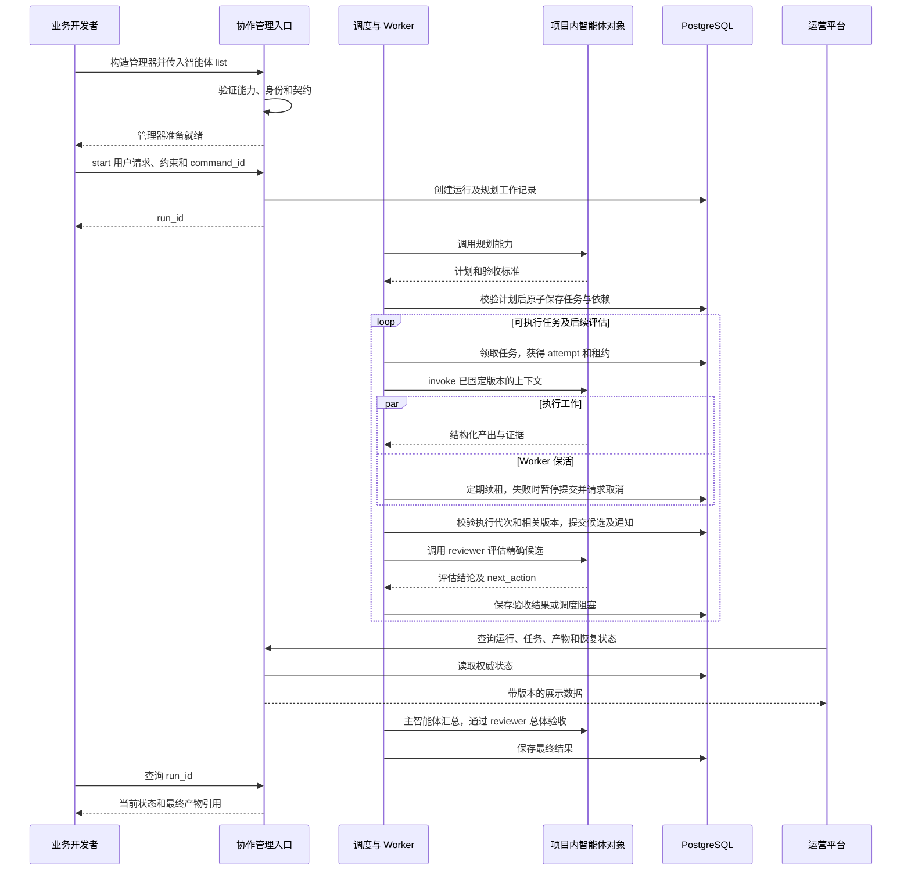
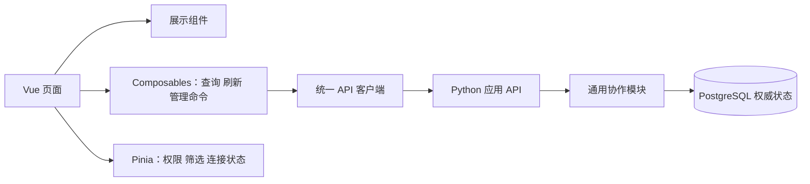
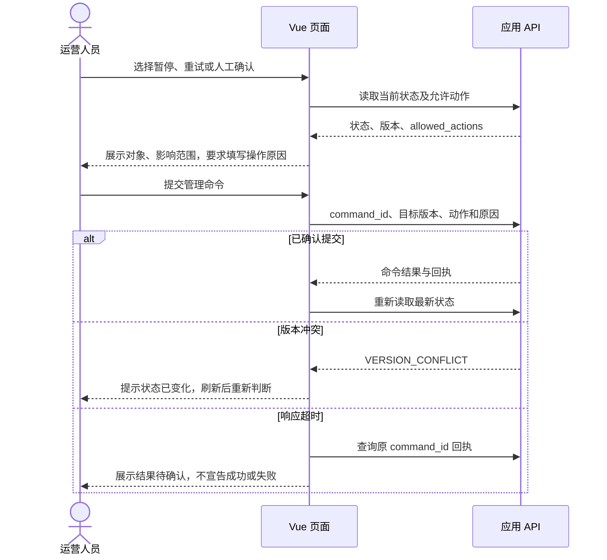

# 协作托管与运营平台开发设计

最后修改时间：2026-10-08 17:59:06（北京时间，UTC+08:00）

开发语言为 Python 3.12，权威状态使用 PostgreSQL。本开发文档规定同一套代码中业务智能体、通用协作模块与运营平台的边界、接口及开发顺序，不实现具体智能体框架。目标是开发者提供智能体集合即可接入协作，同时使运营平台能够独立开发和部署。

## 1 交付目标与解耦边界

**智能体代码和协作代码就是同一套代码，协作模块是其中抽象出来的通用能力。** 这里的解耦是模块职责与依赖解耦，不是独立服务、独立 SDK 或独立协作产品。

业务开发者定义解决特定问题的智能体创建方法，将创建的对象组成 `list`，传入本项目的通用协作管理器。管理器复用同一组规划校验、依赖调度、版本、租约、评估、消息及恢复逻辑；更换业务智能体时，无需重复实现这些协作规则。

当前是一套应用代码。运营平台先在该项目中搭建，通过应用的查询与管理 API 工作，保留后续拆出的边界。若以后拆成两个项目，分别为完整的智能体应用代码和运营平台代码；业务智能体与通用协作模块始终一起保留。

模块依赖方向为：应用启动代码分别创建业务智能体和协作管理器，再将对象集合注入管理器；协作模块只依赖统一调用契约，不依赖具体业务智能体模块。业务智能体只关心任务输入、工具和输出，不自己实现任务领取、续租或数据库状态提交。

“托管”表示管理器负责调用这些已创建的智能体对象及其协作生命周期。本阶段不设计远端智能体注册平台，也不要求开发者将智能体部署成独立服务。



平台监控不在业务执行的关键路径中。平台故障时，已运行的协作可以继续；应用运行故障时，平台展示连接状态和最后读取时间，不能把旧缓存显示为当前有效状态。

## 2 协作托管与智能体各自负责什么

| 事项 | 智能体负责 | 协作托管负责 |
| --- | --- | --- |
| 规划 | 理解用户目标，输出任务、依赖、标准和建议 | 校验计划、权限、无环与输出契约，保存有效计划 |
| 执行 | 根据任务上下文调用工具，形成产出与证据 | 选择执行者、领取任务、租约续期、版本校验和提交 |
| 评估 | 判断指定产出是否满足标准，给出理由及后续动作 | 验证评估身份和依据，执行状态转换及调度阻塞 |
| 重试 | 提供可复用结果或新计算 | 决定重试边界、预算、幂等、接管和恢复位置 |
| 通信 | 返回结构化输出或报告执行观察 | 持久化共享状态、Outbox、通知去重和重放 |
| 工具副作用 | 通过受控工具入口请求动作 | 登记业务幂等键与动作状态，防止危险重放 |

主智能体提供规划和调度建议，通用协作模块通过确定性规则执行这些建议。主智能体不能直接修改 owner、版本或租约，也不能绕过用户授权批准目标变化。

开发者无需为每个智能体编写任务领取、数据库访问、心跳或消息订阅。协作 worker 负责取得授权、构造上下文、调用适配器、维护租约并提交结果；智能体只实现 plan、execute 或 evaluate 能力。

## 3 协作管理入口

公开入口为 CollaborationManager。开发者调用智能体创建方法，将带有身份、角色和能力描述的智能体对象组成 list，直接传给管理器构造入口。管理器验证并保留对象引用；运行时调用 start(user_request, constraints, command_id)，不需要先调用远端团队注册 API。

入口必须接收三个参数：

| 参数 | 类型 | 规则与用途 |
| --- | --- | --- |
| agents | list[AgentBinding] | 非空智能体集合；显式身份、角色和能力 |
| name | str | 协作方案的唯一英文标识，用于检索、日志、指标和平台筛选 |
| description | str | 必填用途描述，建议中文，说明解决什么问题及适用范围 |

name 使用小写 ASCII 英文字母、数字和下划线，以英文字母开头，总长度 3 至 64，例如 `order_revenue_analysis`；校验正则为 `^[a-z][a-z0-9_]{2,63}$`。拒绝中文、空格、大写和不合法字符，不静默改名，避免定位歧义。

名称在同一应用的权威注册库中唯一，PostgreSQL 对 collaboration_definitions.name 建立唯一约束，多进程不能各自只查内存后注册。同名不同定义返回 NAME_CONFLICT。服务重启或多个实例加载同一名称时，只有持久元数据一致才可重新绑定本地对象，不能覆盖既有定义。定义包括 description、agent_id、角色、能力和实现版本；描述更新走显式管理命令并保留记录。

description 去除首尾空白后要求 1 至 500 字符，不承担身份标识。名称创建后固定；同一方案可运行多次，每次生成不同 run_id。名称标识协作方案，run_id 标识一次运行，agent_id 标识其中的智能体。

接入时必须验证：智能体 ID 唯一、角色绑定存在、规划和评估能力齐全、执行能力能覆盖任务类型、输出契约版本受支持。不能仅根据自然语言名称推断角色。

下面的代码展示 Python 3.12 契约，不包含服务实现。所有示例均使用中文注释和文档字符串。

```python
from dataclasses import dataclass
from typing import Literal, Protocol

# 角色由开发者显式绑定，协作模块据此选择规划、执行和评估对象。
type AgentRole = Literal["planner", "executor", "reviewer"]


@dataclass(frozen=True, slots=True)
class Invocation:
    """由协作模块构造版本固定的上下文，传给业务智能体处理。"""

    invocation_id: str
    kind: str
    context_json: str


@dataclass(frozen=True, slots=True)
class AgentOutput:
    """规范化业务输出，交给协作模块校验并提交共享状态。"""

    schema_version: str
    payload_json: str


class AgentCallable(Protocol):
    """表示同一项目中已创建的智能体对象，不涉及 HTTP 注册。"""

    async def invoke(self, request: Invocation) -> AgentOutput:
        """执行特定业务逻辑，返回结果而不直接修改协作状态。"""
        ...


@dataclass(frozen=True, slots=True)
class AgentBinding:
    """将智能体对象与角色、能力绑定，作为 list 中的一项。"""

    agent_id: str
    role: AgentRole
    capabilities: tuple[str, ...]
    implementation_version: str
    agent: AgentCallable


class CollaborationManager(Protocol):
    """由工厂接收智能体集合并建立托管关系，隐藏一致性实现。"""

    async def start(
        self, user_request: str, constraints_json: str, command_id: str,
    ) -> str:
        """创建运行，调用规划对象并托管后续执行，返回 run_id。"""
        ...

    async def get_run(self, run_id: str) -> dict:
        """读取共享状态，返回任务、评估、阻塞和产物信息。"""
        ...


def create_collaboration(
    agents: list[AgentBinding],
    *,
    name: str,
    description: str,
) -> CollaborationManager:
    """接收对象集合、唯一英文名称及用途描述，校验并构造管理器。"""
    # 这是接口设计占位；实现时校验名称格式、非空描述和数据库唯一性。
    # 智能体对象保留于进程内，只持久保存协作定义和能力元数据。
    raise NotImplementedError("待实现协作管理器构造逻辑")
```

应用启动代码的组装方式如下，create_* 是开发者在本项目定义的创建方法，不是协作模块提供的智能体实现：

```text
planner = create_planner_agent()
executor = create_order_analysis_agent()
reviewer = create_reviewer_agent()

agents = [
    AgentBinding("A", "planner", ("plan", "summarize"), "v1", planner),
    AgentBinding("B", "executor", ("order_analysis",), "v1", executor),
    AgentBinding("C", "reviewer", ("evaluate",), "v1", reviewer),
]
manager = create_collaboration(
    agents,
    name="order_revenue_analysis",
    description="分析订单收入及环比变化，由评估智能体核对证据并验收报告。",
)
run_id = await manager.start(user_request, constraints_json, command_id)
```

若开发者创建的对象调用方式不同，例如使用某种图的 invoke/ainvoke 方法，就在业务接入模块薄封装为 AgentCallable，转换输入输出即可；不用改变协作核心。底层方法名或使用的框架不决定协作协议。

对象引用留在进程内，collaboration_definitions 保存协作定义 ID、唯一 name、description 和智能体元数据。runs 通过定义 ID 关联方案，并保存启动时的名称、描述和定义版本快照，历史监控不随描述修改漂移。进程重启时启动代码重新创建同样的 list，协作模块核对运行所需身份和版本，再恢复允许恢复的步骤；对象缺失或版本不匹配时阻塞运行。运行中的对象集合固定，不允许无记录替换。

## 4 托管核心的模块设计

模块之间通过内部接口协作，领域层不 import 智能体实现或运营平台模块。

| 模块 | 做什么 | 怎么做 |
| --- | --- | --- |
| manager | 接收智能体 list、创建运行、接收管理命令 | 验证请求并调用领域服务 |
| planning | 调用规划智能体并保存计划 | 将输出适配为任务契约，验证边界和依赖 |
| scheduler | 选择可执行任务及智能体 | 查询依赖和阻塞，按策略生成持久派发记录 |
| worker | 托管一次智能体调用 | 领取、续租、invoke、输出校验、结果提交 |
| evaluator | 托管评估调用 | 固定候选版本，校验 next_action 后推进状态 |
| coordination | 执行共享命令 | 项目锁、相关版本、权限、状态机及回执 |
| recovery | 恢复过期或不确定执行 | 检查外部动作，撤销旧权利，设置恢复阻塞 |
| messaging | 派发通知和去重消费 | Outbox/Inbox、至少一次通知与周期扫描 |
| storage | 保存权威状态 | PostgreSQL 事务及一致快照 |
| adapters | 连接不同智能体与工具 | 转换输入输出，阻止无结构结果进入验收 |

外部写动作必须经过 ToolActionPort 等受控工具接口：先登记 action_id、business_key、resource_key 和执行代次，再发送，记录或回查结果。开发者直接调用外部写接口会绕过协作恢复协议，服务无法承诺防重；注册策略需要明确该能力边界。

## 5 托管调用时序



Worker 的心跳与智能体调用并发执行，但不能在数据库事务中等待模型。输出返回时必须检查授权仍有效，心跳成功也不能代替最终提交校验。

## 6 运营平台监控与管理

### 6.1 展示能力

| 页面 | 展示信息 |
| --- | --- |
| 协作方案列表 | 唯一英文名称、用途描述、角色集合、定义版本和可用性 |
| 运行列表 | 协作名称、用途描述、run_id、用户目标摘要、状态、耗时、任务完成数、阻塞数 |
| 运行详情 | 计划、依赖图、任务时间线、当前有效决策 |
| 任务详情 | 分配、attempt、租约、输入快照、产物、证据和评估 |
| 智能体列表 | 能力、适配器版本、可用性、并发占用、调用失败 |
| 恢复中心 | unknown 外部动作、租约失效、human_required、补偿记录 |
| 运营指标 | 冲突、重试、验收拒绝、Outbox 积压、未知动作持续时间 |

展示状态与时间戳来自协作服务。第一阶段采用分页查询与周期刷新；若增加推送，通过协作服务提供事件流，不直接连接内部消息主题。日志正文、用户输入、工具结果按权限脱敏，密钥不进入页面。

### 6.2 管理动作

管理操作统一携带 command_id、目标版本和原因，经协作服务认证授权后执行，并保存操作者及结果。

| 动作 | 明确语义 |
| --- | --- |
| 暂停运行 | 停止领取新的任务；在途工作默认允许提交，页面明确显示暂停策略 |
| 恢复运行 | 重新评估依赖及阻塞，再允许调度 |
| 取消运行 | 撤销当前执行授权并请求取消调用；不声称已撤回远端副作用 |
| 重试任务 | 检查旧 attempt 及外部动作，确认可安全重试后创建新执行 |
| 人工确认 | 提交证据及裁决，解除或保留 human_required 阻塞 |
| 修改计划 | 经版本和权限校验，更新标准及依赖，使受影响结果失效 |

平台按钮不直接修改数据库字段。暂停状态不能由前端自己推断；取消时若有未决外部动作，继续展示 recovery_required，不能把界面上的取消等同于已安全结束。

### 6.3 Vue 前端技术与职责

运营前端采用 Vue 3、TypeScript 和单文件组件，使用 Composition API 与 `<script setup>` 编写页面。Vue Router 管理页面路由，Pinia 保存用户权限、全局筛选条件和连接状态。页面局部数据保持在组件或 composable 中，避免把整个运行历史放进全局状态。[Vue 文档](https://vuejs.org/guide/introduction.html)、[Vue Router 文档](https://router.vuejs.org/introduction.html)、[Pinia 文档](https://pinia.vuejs.org/introduction.html)

前端只负责展示和提交用户操作，任务状态、权限和版本由后端裁定。智能体集合在 Python 代码中创建，页面不提供上传 Python 代码或临时创建智能体对象的入口。

### 6.4 页面与路由设计

| 路由 | 页面 | 核心交互 |
| --- | --- | --- |
| `/overview` | 运营概览 | 展示运行数、阻塞数、未知动作与消息积压，点击指标进入筛选列表 |
| `/collaborations` | 协作方案 | 按唯一英文 name 搜索，展示 description、角色集合及定义版本 |
| `/collaborations/:name` | 方案详情 | 查看已配置智能体、能力、历史运行；填写问题和约束启动运行 |
| `/runs` | 运行列表 | 按方案名称、状态、时间筛选，分页查看 run_id 和进度 |
| `/runs/:runId` | 运行详情 | 查看目标、依赖图、时间线、决策、最终产物及管理入口 |
| `/tasks/:taskId` | 任务详情 | 查看输入快照、attempt、租约、结论、产物及评估证据 |
| `/agents` | 智能体状态 | 按所属方案查看角色、能力、实现版本和调用状况 |
| `/recovery` | 恢复中心 | 处理 unknown、human_required、冲突及补偿；提交证据和原因 |

筛选条件写入路由 query，支持刷新、复制链接和返回保留条件。name 在链接中按路径段编码；API 仍校验名称格式与访问权限。运行详情默认展示“概览、任务图、执行时间线、评估与产物、管理记录”标签页。

页面采用左侧导航、顶部连接状态与用户信息、主体内容区。状态必须同时显示文字和颜色；空数据、无权限、加载失败与请求中分别展示，不能都表现为空列表。租约倒计时仅供展示，服务返回 server_time 和 lease_until，后端授权检查才是实际有效性依据。

### 6.5 组件与数据流



可复用组件包括 CollaborationCard、RunTable、TaskDependencyGraph、TaskTimeline、StatusBadge、EvidencePanel、ArtifactPanel、LeaseStatus 和 CommandDialog。任务图只展示服务端提供的节点、边和状态，不在浏览器重新推导权威依赖或执行调度。

API 客户端集中处理鉴权、错误码、超时、请求取消及响应类型。OpenAPI 契约生成或维护 TypeScript 类型，不直接复制 Python ORM。只读请求允许有界重试；写请求保留原 command_id，结果未知时查询回执，不自动生成新 ID 重发。

第一阶段使用页面可见时每 5 秒刷新活动列表和详情，完成的运行停止自动刷新。离开页面、切换查询或标签页隐藏时取消或暂停查询；通过请求序号避免迟到响应覆盖新筛选结果。后台恢复可见时立即读取最新快照。关联的任务、决策与评估详情应通过一致快照接口返回，避免多个独立请求拼出不同时间的运行状态。

服务端响应带数据版本和更新时间，页面明确显示最后成功刷新时间。实时推送后续仅用于触发重新查询，不直接以通知正文覆盖状态。前端不连接数据库或内部消息总线。

### 6.6 管理操作流程



命令提交期间禁用同一动作按钮，防止重复点击；后端幂等仍是最终保护。管理操作不进行乐观状态更新。取消、补偿和修改计划展示影响范围；unknown 外部动作展示证据与恢复选项，不提供无条件“强制重跑”按钮。

权限既影响按钮可见性，也由 API 再次校验。前端路由守卫用于导航体验，不能代替鉴权。用户内容、工具输出和产物预览默认按文本渲染；富文本需要清理，不将不可信内容直接传给 v-html。长日志和任务列表分页或按需加载，产物访问经授权接口取得。

### 6.7 Vue 目录与中文注释

```text
frontend/
  package.json                    # 前端构建、检查与依赖配置
  src/
    main.ts                       # 初始化 Vue、路由与 Pinia
    App.vue                       # 应用布局入口
    router/index.ts               # 路由、页面权限与导航
    api/client.ts                 # 请求、鉴权、错误和回执查询
    api/types.ts                  # 与公开 API 对应的类型
    api/collaborations.ts          # 协作方案查询及启动
    api/runs.ts                   # 运行、任务与管理命令
    stores/session.ts             # 用户权限和连接状态
    stores/filters.ts             # 共享筛选偏好
    composables/usePolling.ts     # 可取消刷新及迟到响应保护
    composables/useCommand.ts     # 稳定命令 ID 和不确定提交处理
    views/                        # 概览、方案、运行、任务与恢复页面
    components/                   # 图、时间线、证据和管理对话框
  tests/                          # 数据刷新、权限及命令交互测试
```

Vue、TypeScript 和样式中的关键逻辑同样使用中文注释，说明做什么和怎么做，特别解释取消刷新、响应防覆盖、版本冲突与回执恢复。前端构建配置中的 API 地址来自环境配置，后续拆出平台时无需导入或修改 Python 协作源码；浏览器侧配置不得包含密钥。

验收包括：按 name 定位协作方案；运行详情与快照一致；重复点击不会重复生效；旧查询响应不覆盖新页面；断网时不伪造成功；无权限用户不能执行管理；离开页面后没有遗留轮询；拆分部署后仅修改 API 地址即可使用。

## 7 应用与运营平台的接口边界

应用 API 层提供版本化 HTTP API 和 OpenAPI 契约，内部调用通用协作模块；业务智能体与协作模块之间直接使用代码接口。运营平台只依赖这些契约，不引用核心的 ORM、内部事件类型或运行对象。

| API 类别 | 主要接口 |
| --- | --- |
| 启动 | POST `/v1/runs`，使用服务启动时由代码绑定的智能体集合 |
| 查询 | GET `/v1/collaborations`、GET `/v1/runs`、GET `/v1/runs/{id}`、GET `/v1/runs/{id}/tasks` |
| 明细 | GET `/v1/tasks/{id}`、GET `/v1/agents`、GET `/v1/recovery-items` |
| 管理 | POST `/v1/runs/{id}/commands`、POST `/v1/tasks/{id}/commands` |
| 恢复与回执 | POST `/v1/recovery-items/{id}/commands`、GET `/v1/commands/{id}` |

智能体集合由运行项目的代码初始化并传入，不通过平台 HTTP API 上传 Python 对象或注册远端端点。平台的启动 API 使用 collaboration_name 选择代码已绑定的方案，并传入用户请求与约束。查询支持按 collaboration_name 筛选，详情返回 description、定义版本及 run_id。日志关联 name、run_id、task_id 和 agent_id；指标以 name 和有限状态作标签，run_id 只用于日志与明细，避免高基数指标。

平台服务端只保存自身的用户展示偏好或缓存，使用独立数据空间。协作状态只有应用内部的通用协作模块有写权限。平台向应用 API 传递可验证的用户身份或受限委托凭证，不能凭一个可伪造 actor_id 执行管理命令。

契约包括分页、时间格式、状态枚举、错误码、版本和回执。连接超时后平台查询回执，不自行换 command_id 重复发起动作。产物访问使用权限检查后的引用或短期链接。

## 8 同一套代码的目录与平台拆分边界

初期使用一套应用配置和依赖。business_agents 保存业务智能体，collaboration 保存通用协作逻辑，api 对外服务运营页面，operations 保存平台界面与展示逻辑。后续只拆出 operations，不拆业务智能体与 collaboration。

```text
project/
  pyproject.toml                   # 整套应用共用的 Python 3.12 配置
  src/app/
    business_agents/               # 业务智能体定义和 create_* 方法
    collaboration/                 # 抽象后的通用协作模块
      manager.py                   # 接收智能体 list 并管理运行
      domain/                      # 依赖、权限、状态及版本规则
      workers/                     # 执行、续租、评估和恢复
      contracts/                   # 与业务智能体之间的代码契约
      storage/                     # PostgreSQL 状态及事务
      messaging/                   # Outbox、Inbox 和通知
    bootstrap.py                   # 创建业务智能体并注入管理器
    api/                           # 应用对外查询与管理入口
    operations/                    # 运营展示逻辑，只使用公开 API
  frontend/                        # 运营界面，可随平台一起拆出
  contracts/openapi.yaml           # 运营平台使用的公开契约
  migrations/                      # 应用数据库迁移
  tests/                           # 业务、协作及平台边界验证
  examples/three_agents/           # 同一套代码中的 list 调用示例
```

将来拆分平台时迁移 operations、frontend 及其展示依赖，business_agents、collaboration、bootstrap 和应用 API 一起保留，平台的应用 API 地址成为配置项。平台客户端依据发布契约生成或封装，不能通过相对路径 import 协作源码。契约升级保持兼容窗口，协作数据库迁移仍由智能体应用统一管理。

## 9 中文代码注释标准

所有新增代码使用中文注释说明意图和关键做法，标识符保持清晰且统一。公共模块、类和函数有中文文档字符串；状态转换、版本条件、锁顺序、重试及恢复分支有对应解释。无需机械逐行翻译赋值语句。

注释至少回答两件事：**做什么**，例如拒绝旧执行者提交；**怎么做**，例如在项目行锁内比较 attempt_id 和 fencing_token。不能用“更新状态”掩盖权限与并发前提。

```python
def matches_attempt(
    current_attempt_id: str,
    current_token: int,
    submitted_attempt_id: str,
    submitted_token: int,
) -> bool:
    """比较执行身份和代次，作为拒绝旧执行者的一个校验条件。"""
    # 同时比较身份和代次，避免旧回调被当作当前执行结果。
    # 调用者仍须在数据库事务中检查 owner、租约、状态和业务版本。
    return (
        current_attempt_id == submitted_attempt_id
        and current_token == submitted_token
    )
```

SQL 迁移注释解释表的权威职责及约束；配置注释解释单位、默认值及行为；测试注释说明复现的竞争或故障。修改逻辑必须同步修正注释，不得让注释承诺代码没有实现的保证。

## 10 开发顺序与验收

1. **定义契约**：智能体调用契约、任务与结果结构、管理 API、错误码；验证三个不同实现能够统一接入。
2. **完成托管闭环**：集合注入、计划校验、任务依赖、执行与独立验收；通过带 name、description 的入口跑通三个智能体示例，并验证非法名称、重复定义及重启重绑定。
3. **保证可恢复性**：版本检查、命令回执、租约与 fencing、外部动作记录、Outbox/Inbox；验证迟到提交和故障恢复。
4. **建设运营平台**：先只读查询，再实现带权限、版本与回执的管理操作。
5. **验证解耦**：验证 business_agents 与 collaboration 通过代码契约协作，平台通过公开 API 访问；平台拆出后应用内部结构不变。

最终验收标准：业务开发者无需操作协作数据库即可通过 list 注入并运行智能体集合；暂停或替换平台不影响协作核心运行；单独部署平台时不依赖核心源码；旧执行结果不能覆盖新状态；未决外部动作不会被自动重放；运营管理动作可授权、可追溯、可幂等；所有新增代码符合中文注释规范。

本交付为开发设计与接口参考。时序图、目录和类型定义描述待实现的结构，不代表已经完成服务、平台或数据库部署。
