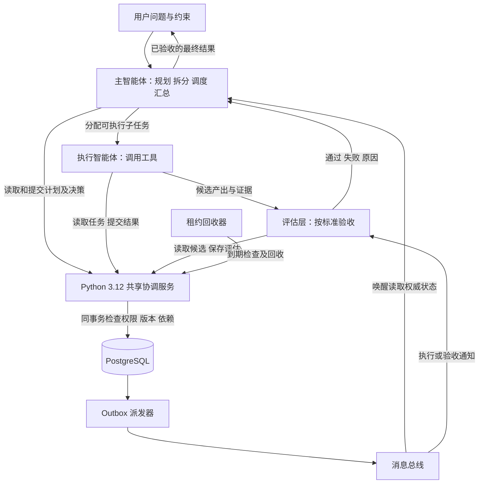
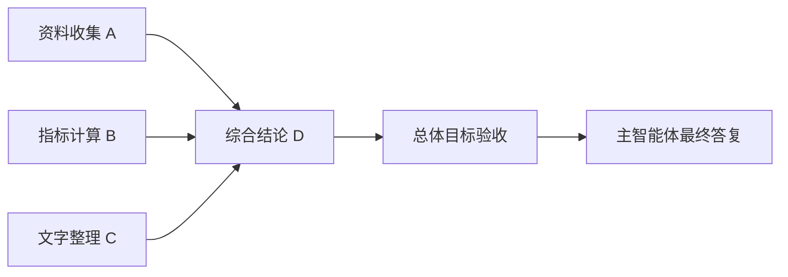
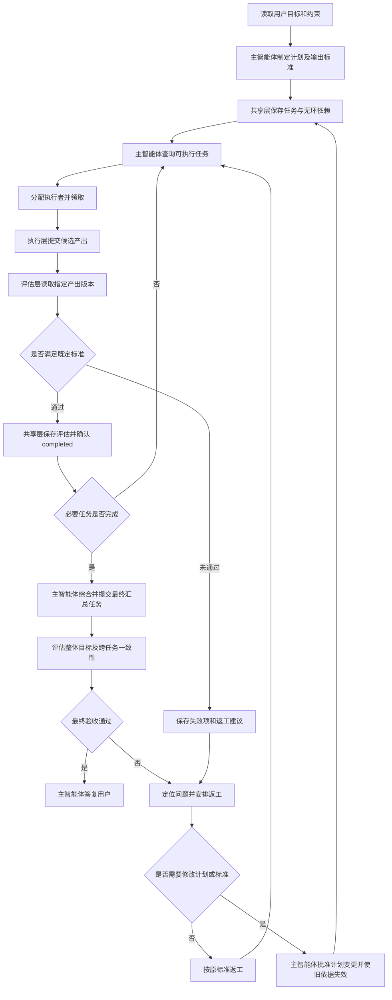
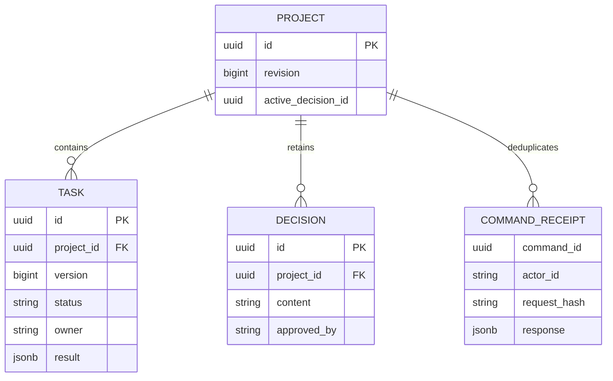
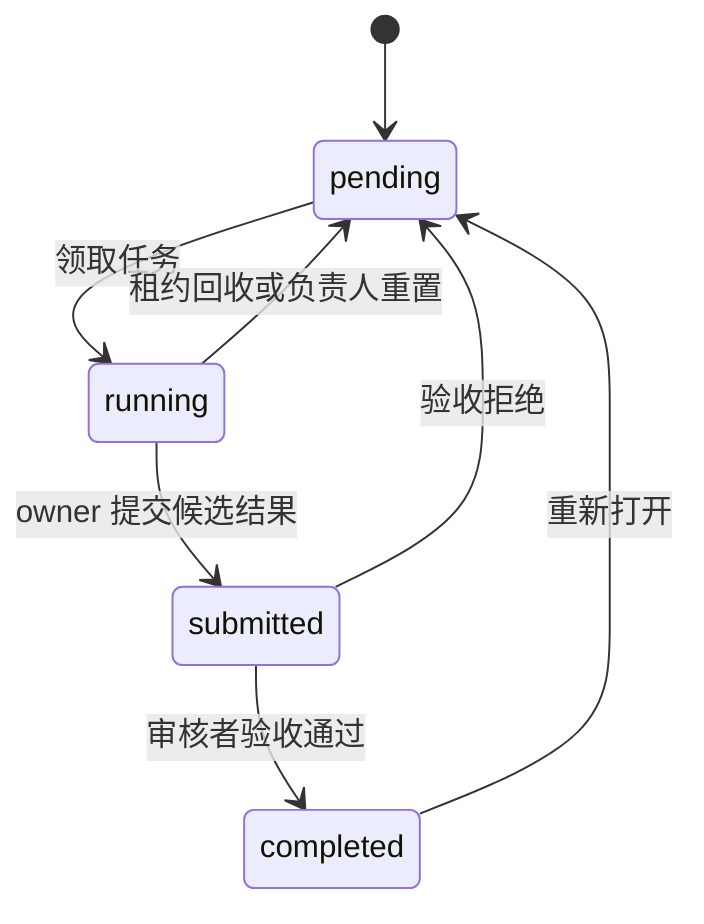
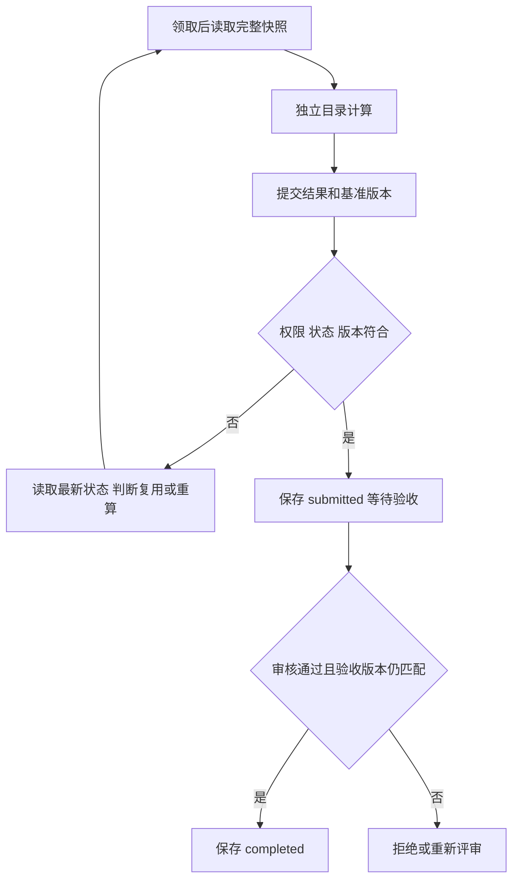
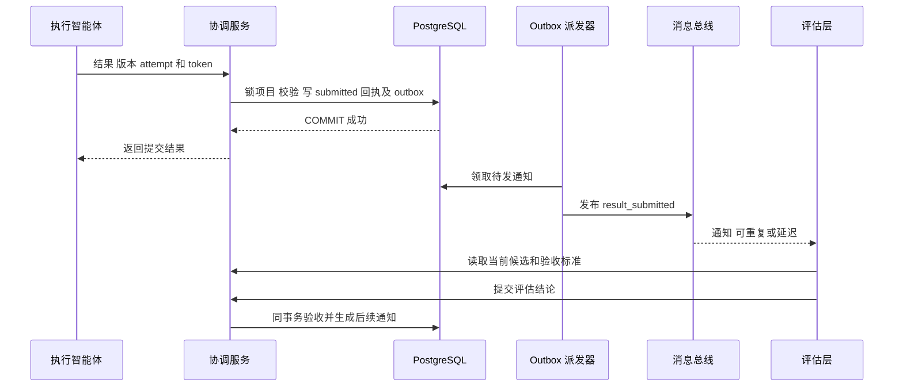
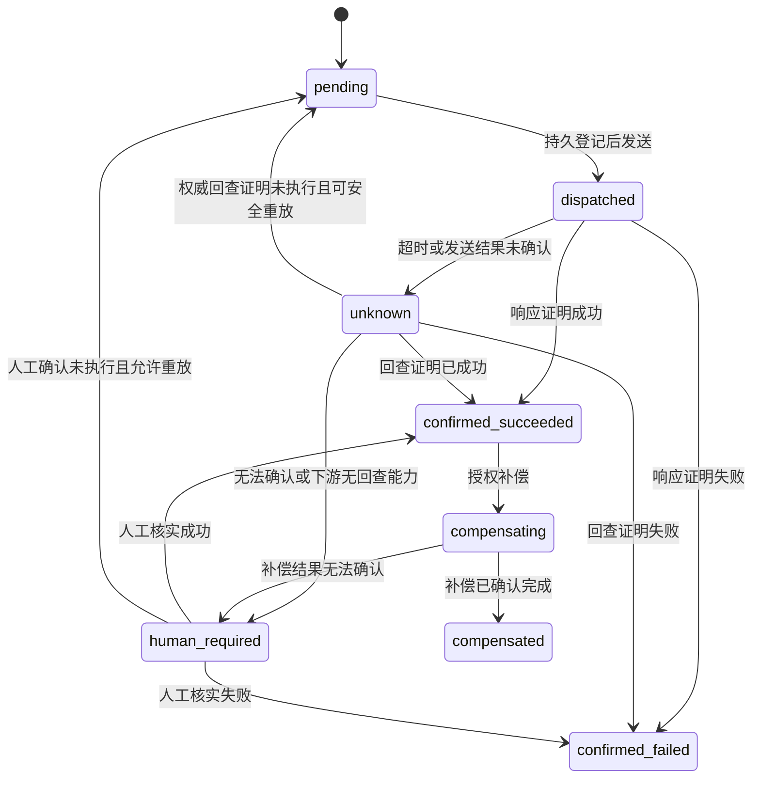

# 多智能体一致性解决方法参考

最后修改时间：2026-10-08 17:30:21（北京时间，UTC+08:00）

适用语言：Python 3.12。存储：PostgreSQL。目标：建立主智能体调度、执行层产出、评估层验收和共享层协调的完整闭环，不讨论智能体框架选择。

**一致性的本质，是对共享事实、变更顺序和决策权限建立共同规则。** 不要求智能体想法一致，而是要求它们能确定：任务现在是什么状态、自己的结果是否仍适用、当前哪项决策有效。

核心标准只有一条：**共享状态通过协调服务修改，服务在同一个数据库事务中检查权限、版本和业务条件，再保存结果。** 智能体可以并行计算，共享状态的生效由服务决定。

## 1 指导思想与三个一致性问题

全文以若飞的[《面试官：讲一讲多 Agent 协作如何保持一致性》](https://mp.weixin.qq.com/s/XnSQdFpG-MdbctvLtHiMMA)为指导：先说明任务为什么拆分，再明确交接依据、状态推进、冲突裁决、验收证据和恢复位置。模型判断下一步，系统记录并验证实际发生的步骤。

据此，本方案遵守五个原则：任务边界明确；交接对象可继续执行；判断与证据分开；完成由验收决定；故障优先局部恢复。下面的 PostgreSQL、租约和消息协议是对这些原则的具体设计，不是对原文全部机制的照搬。

| 断裂面 | 典型问题 | 最小解决方法 |
| --- | --- | --- |
| 认知断裂 | A 认为完成，B 认为未完成 | 共享任务定义和验收标准；提交结果与确认完成分开 |
| 时序断裂 | B 在旧状态上计算，覆盖 A 的新结果 | 读取时获得版本，提交时检查版本；冲突后重新判断 |
| 决策断裂 | B 的意见直接推翻 A 的决定 | 保存明确的有效决策；只有授权负责人可以批准和替代 |

聊天消息用于讨论，数据库记录用于确定当前状态。数据库保存的结果仍可能判断错误，但错误可以通过明确的重新打开或决策替代来修正。

参考 DeepSeek Harness 的两点即可：共享任务更新检查 revision，以及把协作规则集中到服务中。本文不照搬其邮箱、运行时生命周期或协作工具体系。[任务板源码](https://github.com/deepseek-ai/deepseek-harness/blob/master/packages/experimental/agent-team/src/task-board.ts)

## 2 主智能体调度与执行评估闭环

系统以主智能体为调度入口：它理解用户目标，制定计划，将问题分解为具有明确输入、输出和验收标准的子任务，建立依赖关系，再把可执行任务分配给执行智能体。执行智能体通过工具完成任务并提交产出；评估层检查产出是否满足标准，将评估结果保存到共享层并反馈给主智能体。主智能体据此继续调度、安排返工或修改计划，最终汇总已经通过评估的结果回答用户。

“工具层智能体”更准确地称为“执行智能体”：智能体负责理解任务和执行策略，工具是它调用的具体能力。评估层是一种独立职责，可以由评估智能体、确定性校验程序或人工承担，不要求每项任务都额外创建一个评估智能体。

### 2.1 四类职责

| 角色或层 | 负责什么 | 生效边界 |
| --- | --- | --- |
| 主智能体与调度层 | 理解目标、拆分任务、定义依赖和标准、分配执行、处理分歧、汇总结果 | 在用户授权范围内批准计划和决策，不通过聊天直接改权威状态 |
| 执行层 | 读取任务与有效输入，调用工具，提交候选产出和证据 | 不能自行宣布 completed，也不能改验收标准 |
| 评估层 | 对指定版本的产出按既定标准验收，给出通过或失败及理由 | 只能验收或提出建议，不能默默改变任务目标和标准 |
| 共享协调层 | 保存计划、任务、依赖、产出、评估和决策，校验权限、版本与状态转换 | 执行确定性规则，不负责替主智能体规划或判断内容质量 |

主智能体可以同时承担规划和调度，避免再拆分多个管理智能体。重要结果的执行者和评估者应分开；简单任务可以直接使用规则或测试验收。主智能体拥有调度权，但最终答案仍需要经过总体目标验收。



图中的任务分配与结果反馈是逻辑关系。具体任务、产出和评估都写入共享层，通过 ID 与版本引用；消息可以提醒对方读取，但不承担权威状态传递。

### 2.2 任务拆分与依赖规则

每个子任务至少包含：任务描述、输入来源、预期输出、验收标准、前置任务 ID 和指定执行者。执行者只有在被分配后才可领取；共享服务核对身份，不允许任意成员抢占指定任务。

依赖表达“B 的执行需要 A 的有效产出”，不是泛泛的讨论顺序。例如资料收集 A、指标计算 B、文字整理 C 可以并行；综合结论 D 依赖三者通过验收后的结果。主智能体负责提出依赖图，服务检查引用存在、不跨项目、无自依赖和无环。

拆分前检查三个问题：子任务能否明确独立输入和输出；是否依赖另一个任务尚未产生的中间状态；是否修改同一业务资源。输入输出说不清时先合并；需要中间结果时建立顺序依赖；共享写资源时串行执行。只读同一份不可变输入不必视为高耦合。

计划命令要求每个任务声明 input_refs、output_schema 和 write_resources。服务拒绝缺少边界或形成环的计划，并拒绝把写资源重叠、彼此无依赖的任务标为可并行。资源标识必须规范化，目录包含关系也算重叠；该检查不替代主智能体对语义耦合的判断。

只有前置任务全部 completed，任务才可领取。blocked 作为查询结果中的派生属性，不增加存储状态。输入记录上游任务版本和产物摘要，提交及验收时重新检查上游仍有效。



主智能体在创建计划时声明哪些任务是最终结果所必需的。子任务全部通过不等于整体问题解决：最终汇总也作为一个任务，检查完整性、跨任务矛盾和用户约束；该任务通过后才结束。

### 2.3 调度流程



返工要明确失败原因和下一次输出要求，避免无限重试；主智能体设置尝试上限或执行预算。无法继续时记录阻塞原因，向用户说明缺少的信息或约束冲突，而不是强行宣布完成。

评估失败不自动代表计划错误。产出不达标先按原标准返工；只有目标、输入或分解方法有问题时，主智能体才修改计划或标准。超过原用户授权的变化需要用户确认。

### 2.4 共享层如何处理三个断裂面

认知断裂通过共享任务定义、输出标准、产出版本与评估结论解决，各层读取同一事实基准。时序断裂通过项目版本、任务版本及依赖检查解决，旧基准上的产出不会直接生效。决策断裂通过明确批准权限、有效决策指针和计划变更记录解决，执行者或评估者的建议不会自动变为新要求。

共享层不是把所有智能体上下文复制到数据库，而是保存协作所需的最小事实。各智能体仍有自己的推理过程，但共享承诺必须经过同一提交规则。

本方案采用协调服务、PostgreSQL、执行租约和消息总线。消息唤醒各层读取权威状态，租约管理临时执行权；执行者使用独立目录，正式结果由调度层安排整合。

### 2.5 交接的是工作状态

交接采用一个小型结构化对象，引用共享层记录和原始来源。自然语言摘要帮助理解，不代替事实出处。

| 交接字段 | 内容 |
| --- | --- |
| global_task_id / task_id | 全局请求身份与子任务身份；project_id 作为项目容器，不能代替全局请求身份 |
| input_snapshot | 结构化基准：plan_version、decision_id、任务版本、上游结果版本与摘要、外部输入版本 |
| evidence_refs | 原始证据引用及来源、时间范围 |
| assumptions | 尚未验证的假设 |
| excluded_directions | 已排除方向及排除证据；允许显式空数组 |
| constraints | 授权范围、工具权限、预算与写资源 |
| result_ref | 候选产物不可变引用与摘要；未产出时显式为 null |
| output_schema / acceptance | 输出格式与业务验收条件 |
| acceptance_commands | 可执行检查的命令、预期退出码与报告位置；非命令型验收允许空数组并声明检查方式 |

这些字段可以保存在任务的结构化正文和 result 中，不必再增加表。共享层是协作状态的权威；代码库、测试系统或业务数据库仍是对应事实的来源。评估者需要核对输入版本、产物摘要与验证证据，不能只相信执行者的文字报告。

计划也允许根据新证据调整：主智能体可以暂停派发、合并重复任务或补充新任务，并通过计划命令更新依赖和版本。只有真正独立的任务并行；高度依赖同一输入的任务顺序执行，避免拆分成本超过收益。

以上交接与调度原则参考若飞的[《面试官：讲一讲多 Agent 协作如何保持一致性》](https://mp.weixin.qq.com/s/XnSQdFpG-MdbctvLtHiMMA)。全文围绕这些原则展开，增加自动接管和异步通知，同时保留明确的提交与验收边界。

### 2.6 输出接入与结论语义

每类执行者通过轻量接入适配器输出统一 ResultEnvelope：schema_version、global_task_id、task_id、attempt_id、input_snapshot、result_ref、claims、evidence_refs。适配器只做格式转换、字段与引用校验，不能把缺失证据补成已验证事实。裸自然语言可以作为草稿或正文，缺少必需元数据的结果不能进入验收和最终汇总。

claims 中每条结论使用独立 claim_id，并标注 candidate、verified、conflict 或 rejected。执行者只能提交 candidate；评估层依据证据设为 verified 或 rejected。基于相同对象与可比较输入的相互矛盾结论标为 conflict，保留双方证据，交主智能体处理。不同快照的结论先区分适用范围，不直接认定相互矛盾。工作流 completed 与结论 verified 是不同维度，任务 completed 前必须解决其必要结论中的 conflict。

评估结果增加 next_action：continue、retry、change_route、narrow_scope、human_required。后两类路线或范围变化是提交给主智能体的变更请求，不能直接改用户目标。human_required 和未处理的变更请求会设置任务 dispatch_block，阻止领取及下游推进；主智能体处理后通过带版本命令解除。retry 仍需满足副作用恢复条件。

## 3 共享状态与持久记录

| 表 | 必要字段 | 用途 |
| --- | --- | --- |
| projects | id、revision、plan_version、global_task_id、goal、required_task_ids、active_decision_id | 用户目标、必要任务、项目级版本和有效决策 |
| tasks | id、project_id、version、description、acceptance、dependencies、assigned_to、status、owner、attempt_id、fencing_token、lease_until、dispatch_block、result、evaluation | 子任务、依赖、分配、候选产出和评估结果 |
| decisions | id、project_id、content、reason、approved_by、created_at | 已批准决策的历史，批准后内容不可原地修改 |
| command_receipts | project_id、actor_id、command_id、request_hash、response | 防止请求重试重复生效 |
| outbox | event_id、project_id、project_revision、type、payload、dispatch_until、sent_at | 与业务状态同事务保存待发通知 |
| inbox | consumer_id、event_id、processed_at | 消费者去重；与消费引起的业务修改同事务保存 |
| external_actions | action_id、global_task_id、task_id、attempt_id、business_key、resource_key、state、remote_ref、version | 外部写操作的发送、回查、补偿及接管屏障 |

租约字段绑定当前一次执行。attempt_id 每次领取重新生成，fencing_token 每次重新授权递增且不随重置清零；历史执行信息保存于命令回执。

任务状态仅保留 `pending`、`running`、`submitted`、`completed`。owner 从认证身份设置，不能相信请求正文中的角色声明。主智能体的调度权限与评估者的验收权限由服务的项目权限配置确定，用户保留目标和授权范围的最终决定权。

dependencies 第一版使用任务 ID 数组，服务在项目事务锁内校验任务图；不增加单独的依赖表。evaluation 保存候选摘要、验收标准、通过与否、原因和评估者身份，历史评估保留在命令回执中。

任务 result 保存候选内容或不可变产物引用、内容摘要和必要验证信息。大文件留在产物存储或版本库，数据库保存精确引用；可变文件路径不能作为唯一结果标识。

续租只更新 lease_until，不递增任务业务版本或项目 revision，避免心跳使其他计算持续过期。领取、提交、回收等语义变化仍增加版本。

项目 revision 在每次影响共享事实的修改后递增，包括领取、任务定义修改、结果提交、验收、重置和决策替代。任务 version 在该任务变化后递增。revision 用于审计和通知排序，不再要求所有结果都匹配该全局值。任务 version 保护目标对象；plan_version 保护任务集合、依赖及验收标准；active_decision_id 和相关上游任务版本保护计算依据。



实际主外键应校验 project_id，回执以 `(project_id, actor_id, command_id)` 联合唯一。任务定义和验收条件在领取后保持固定。主智能体修改定义、依赖、标准或重新打开上游任务时，在同一事务内重置目标任务及其所有直接、间接下游任务，撤销 owner 和旧结果、评估，增加任务版本及项目 revision。第一版在规模有限的任务图上遍历下游，不另建复杂失效系统。

## 4 任务怎么完成



1. 主智能体给任务指定执行者。执行者领取 pending 任务时，服务检查分配身份、状态、版本以及前置任务全部 completed，设置 owner、新 attempt_id、fencing_token 和租约截止时间，并返回最新版本。
2. 领取成功后，智能体读取完整项目快照，以任务版本、plan_version、有效决策 ID 和直接依赖的版本及产物摘要作为计算基准。
3. 智能体在自己的工作目录执行并定期续租，提交候选结果、基准版本、attempt_id 和 fencing_token。
4. 服务检查 owner、当前 attempt、有效租约、执行代次、任务版本、input_snapshot 中的计划及决策版本和上游有效产出。全部匹配才保存 submitted，并关闭执行租约；等待验收不再占有执行权。
5. 评估层的授权审核者读取新的快照，检查指定结果是否满足任务的验收条件，并形成结构化评估结论。
6. 审核者提交验收命令，服务再次检查版本和依赖，保存评估并设置 completed。拒绝时清空 owner，回到 pending，记录失败项和建议。主智能体读取评估后决定继续调度或返工。

“执行者停止运行”或“发送完成消息”不代表任务完成。completed 只表示记录中的结果通过了对应验收条件。



提交仍经过项目行锁，但冲突只检查结果的业务依据：目标任务 version、plan_version、有效决策 ID 及直接依赖的版本和摘要。无关任务领取或完成只增加 revision，不使当前结果过期。服务从实际依赖图确定必检对象，不能接受客户端删减读集。

上游变更只重置自身及下游，无依赖关系的任务结果保留。计划结构或验收标准变更提高 plan_version，仍可能保守地要求其他执行者重新读取；允许复用原产物，但必须重新确认适用性。项目行锁保留短事务串行边界，本方案不承诺高并发写入吞吐量。

## 5 决策如何生效

智能体可以自由提出不同建议，建议尚未批准时不改变共享状态。负责人批准后，服务创建不可变 decisions 记录，并在同一事务中切换 projects.active_decision_id、增加项目 revision。

替代旧决策时必须携带读取到的项目 revision，说明替代理由。只有获得调度权限的主智能体或人工负责人可执行，历史决策继续保留。涉及用户目标或超出授权的改变，先由用户确认。智能体使用决策 ID 引用原文，转述消息不能改变批准内容。

决策改变会使旧基准上的候选结果提交失败。第一版采用保守规则：批准新决策时，把 running、submitted 和 completed 任务统一重置为 pending，清空 owner 和当前候选结果，增加任务版本；历史结果仍可从持久命令回执追溯。负责人再安排哪些工作可以复用。这样不需要维护复杂的决策作用域和依赖失效图。

## 6 PostgreSQL 如何保证同一协议

### 6.1 一个项目一把事务锁

每个共享状态修改都先锁住 projects 行，然后读取和验证最新状态，再修改任务或决策。同一个项目的命令因此串行提交；计算过程并行，短暂的状态提交排队。

```text
开始 READ COMMITTED 事务
  锁住 projects 对应行，直到事务结束
  检查认证主体是否有项目访问权限
  查询 command_receipts
    同 ID 同正文：返回原结果
    同 ID 不同正文：拒绝
  检查动作权限、任务状态、任务版本、input_snapshot 和依赖
  执行类提交再检查 attempt、租约和 fencing_token
  修改共享状态并增加版本
  同事务写入 outbox 通知
  保存命令结果到 command_receipts
提交事务
返回结果
```

所有写入口，包括人工重置和管理操作，都必须使用同一项目行锁。默认隔离等级本身不能替代这个约定。READ COMMITTED 的不同语句可能看到不同快照；本方案通过相关 writer 共用行锁保护业务检查。[PostgreSQL 事务隔离](https://www.postgresql.org/docs/18/transaction-iso.html)

下面是领取任务的 SQL 片段。参数为抽象占位符，Python 驱动实现时必须绑定参数。

```sql
BEGIN;

SELECT revision
FROM projects
WHERE id = :project_id
FOR UPDATE;

-- 先检查请求版本、认证权限和幂等回执。
UPDATE tasks
SET status = 'running', owner = :authenticated_actor,
    version = version + 1
WHERE project_id = :project_id
  AND id = :task_id
  AND status = 'pending'
  AND version = :expected_task_version
RETURNING version;

-- 必须恰好更新一行，否则返回冲突。
-- 成功后递增 projects.revision，并保存命令回执。
COMMIT;
```

权限和版本失败时不修改业务状态，返回明确错误。完整命令还需要同事务保存回执；上面不是可直接部署的完整 SQL。

### 6.2 读取一致快照

快照 API 在新的短只读 REPEATABLE READ 事务中读取项目、任务及有效决策，避免把不同时间的记录拼成同一个基准。快照读取完成后立即结束事务，不在模型计算期间持有连接或锁。

验收也需要项目版本检查。这样，在审核期间决策或任务发生变化，旧验收不能直接宣布完成。

### 6.3 请求超时不要重复执行

客户端每条修改命令生成 command_id。状态变更和回执共同提交；同 ID 重试返回原响应。如果连接中断，客户端查询回执或以同 ID、同正文重试，不直接认定失败。

版本冲突则不同：先读取新快照、判断前提，再生成新命令。权限失败和状态错误不自动重试。

单主数据库使用正常 WAL 持久配置，回执和状态表使用普通持久表。高可用部署额外需要同步复制、受控副本提升和旧主隔离；异步复制不能承诺故障切换后保留所有已确认提交。[PostgreSQL 复制说明](https://www.postgresql.org/docs/18/warm-standby.html)

## 7 Python 3.12 接口标准

先提供四类 API，不建立复杂工具体系。

| 接口 | 行为 |
| --- | --- |
| GET `/projects/{id}/snapshot` | 返回任务、有效决策和同一快照的版本 |
| POST `/projects/{id}/plan` | 创建或调整任务、标准、依赖和分配 |
| POST `/tasks/{id}/commands` | claim、submit、accept、reject、reset、reopen |
| POST `/projects/{id}/decisions` | 授权负责人批准或替代决策 |
| POST `/tasks/{id}/renew` | 校验执行身份与租约后续期 |
| GET `/projects/{id}/commands/{command_id}` | 查询当前认证主体的命令回执 |

主智能体通过计划命令创建或调整任务、依赖和执行者分配；计划命令同样遵守项目事务锁、权限、无环校验和幂等规则。reset、reopen 与验收动作限授权负责人或审核者，submit 限当前 owner。

```python
from dataclasses import dataclass
from typing import Literal, Protocol

type TaskAction = Literal[
    "claim", "submit", "accept", "reject", "reset", "reopen"
]

@dataclass(frozen=True, slots=True)
class TaskCommand:
    command_id: str
    project_id: str
    task_id: str
    attempt_id: str | None
    fencing_token: int | None
    action: TaskAction
    expected_task_version: int
    expected_plan_version: int
    expected_decision_id: str | None
    dependency_versions_json: str
    payload_json: str

class CoordinatorClient(Protocol):
    async def snapshot(self, project_id: str) -> dict: ...
    async def execute(self, command: TaskCommand) -> dict: ...
    async def receipt(self, project_id: str, command_id: str) -> dict | None: ...
    async def renew(self, task_id: str, attempt_id: str, fencing_token: int) -> dict: ...
```

actor 由服务认证获得，不放在可随意声明的命令权限字段中。响应至少包含当前任务版本、项目 revision 和结果；冲突响应区分版本变化、权限不足、状态不允许。

## 8 租约 消息总线与故障恢复

**文件采用独立工作目录，正式结果由负责人统一验收和整合。** 每个结果绑定内容摘要或不可变提交 ID；智能体不能直接覆盖正式共享产物。数据库版本检查只能保护记录，不能保护绕过 API 的任意文件写入。需要强制隔离时，以目录权限限制正式目录写入者。

### 8.1 租约与自动接管

租约是有期限的执行授权。初始可采用 60 秒有效期、每 20 秒续租，再根据工具时长和网络情况调整。服务在取得项目行锁后，以数据库当前时间检查租约；客户端时钟不决定权限。续租必须匹配 owner、attempt_id、fencing_token 和未到期租约，不能复活旧授权。

租约回收器取得同一项目锁，确认 running 任务到期后先查询该 attempt 的 external_actions。存在 dispatched、unknown、compensating 或 human_required 动作时，撤销旧授权、增加任务版本，但设置 recovery_required 派发阻塞；只能回查或处理已有动作，不允许新执行者重放。确认无未决动作后才退回可领取的 pending。主智能体决定重新分配，新领取创建新的 attempt 并提高 fencing_token。续租、回收和提交竞争同一锁，因此不能各自独立成功。

租约到期不等于旧进程停止。旧执行者恢复后提交，服务必须拒绝旧 attempt 或旧 token；正式结果整合也只能使用共享层当前已验收的产物引用。续租结果不确定时，执行者暂停发布并读取授权状态。

自动接管前还要核查未确认的外部副作用。只要工具写操作的结果仍 unknown，调度层就暂停重放该动作，先回查或人工处理；租约不能撤销已经发出的远端请求。

### 8.2 消息总线只负责通知

通知类型保持少量：task_ready、result_submitted、evaluation_finished、lease_expired、plan_changed。消息包含 event_id、project_id、task_id、project_revision、attempt_id 和记录引用；正文不复制整个共享上下文。

共享状态、命令回执和 outbox 在同一个 PostgreSQL 事务中提交。派发器用短事务领取待发记录，保存派发租约，在事务外发送，成功后标记已发。发送成功但确认前崩溃会导致重复投递，所以总线采用至少一次交付，消费者按 event_id 去重。

消费者先认证消息来源，再读取最新共享状态。若通知触发业务修改，inbox 去重记录和该修改共同提交；调度产生的后续命令或通知也通过持久记录落地。已处理 inbox 不能先提交再执行尚未记录的动作，否则崩溃可能丢工作。外部工具副作用仍使用业务幂等键。

旧消息不覆盖新状态。消费者通过版本、attempt 和当前状态判断是否仍需行动；通知仅作为唤醒线索，不按消息到达顺序推进任务。各层定期扫描可执行任务、待验收结果和过期租约，以恢复丢失的唤醒，消息总线不可用不会破坏数据库状态，但可能延迟调度。



数据库不可用时保留本地草稿，禁止共享提交。服务重启后恢复 outbox、扫描租约和待评估任务，不把所有任务重新执行。旧备份恢复需停写、隔离旧服务和执行者、撤销全部旧授权，并使旧命令和消息失效后再恢复；不提供无隔离的在线历史回滚。

### 8.3 外部写操作恢复协议

外部动作与协调命令分开登记。business_key 由 global_task_id、稳定业务动作身份和逻辑目标组成；同一动作跨 attempt 重试保持不变，补偿使用独立键并引用原 action_id。数据库对此键建立唯一约束，向支持幂等的下游传递同一键。资源级阻塞以 resource_key 表达，未决动作阻止其他任务对同一资源写入。

发送前必须在项目锁内检查当前执行权及资源屏障，先持久登记 dispatched，再调用远端。这样即使进程在发送前后崩溃，也保守地知道存在潜在在途动作；派发器同样遵守该规则。fencing 只能防止未经授权的新提交，不能撤回已经发送的请求。



回查“未找到”不一定证明未执行，必须排除远端请求仍在途、查询延迟或幂等记录已清理。无法证明时继续 unknown 或转 human_required。confirmed_failed 也不保证无部分副作用：释放资源屏障前必须确认失败无残留、无需补偿；compensated 才表示补偿完成。所有转移带 action version，记录证据，并重新检查资源恢复条件。

### 8.4 只重试需要恢复的步骤

执行成功而评估请求失败时，只重新安排评估，不重新执行已完成的工具动作。失败记录保存在哪个子任务、哪个步骤发生，以及工具动作是否已经完成；主智能体据此决定恢复位置。

任务的 pending、running、submitted、completed 表示工作流状态；只读工具可记录简单 outcome；外部写操作必须使用 external_actions 状态机。unknown 表示调用方没有确认结果，不能直接当作失败重放。

对查询类工具可以按策略重试；修改数据、发送消息或发布等动作使用稳定的业务幂等键，超时后先查询下游结果。重新提交协调命令时保留 command_id；重试同一个外部业务动作时保留它的业务幂等键，两者不能混为一谈。下游没有幂等或回查能力时，先由负责人核查，不宣称数据库回执可以阻止外部重复副作用。

如果旧执行者仍可能完成外部动作，人工 reset 只能撤销它修改共享记录的权利，不能撤回已发出的外部请求。接管前先核查这类动作；因此，自动接管执行计算与重放外部动作必须分别判断。

### 8.5 评估质量的轻量复核

对高影响产出、冲突结论和人工介入项安排第二位审核者；普通任务按配置比例抽样核对原始证据。记录审核者、输入摘要、验收规则和复核结果。复核发现错误时通过 reopen 使该任务及下游结果失效。先采用抽样与定向复核，不新增无限递归的 meta-review 智能体体系。

## 9 最小验收清单

| 场景 | 必须得到的结果 |
| --- | --- |
| 写资源重叠却被标记并行 | 计划校验拒绝或要求顺序依赖 |
| 输出缺字段或只有无来源文本 | 不进入验收和汇总 |
| 必要结论存在 conflict | 不能完成，保留双方证据并裁决 |
| 无关任务状态变化 | 当前结果不因全局 revision 增加而失败 |
| 到期 attempt 存在未决外部写操作 | 阻塞接管及同资源写入，先回查 |
| 评估请求 change_route 或 human_required | 阻止派发，主智能体显式处理 |
| 前置任务未通过评估 | 下游任务无法领取 |
| 修改上游任务或验收标准 | 下游执行权与结果同步失效 |
| 子任务通过但汇总违反用户约束 | 最终验收不通过，不结束任务 |
| 两个执行者同时领取同一任务 | 只有一个获得 owner |
| A 提交后 B 使用旧项目版本提交 | B 被拒绝，不覆盖 A |
| 负责人替代有效决策 | 旧执行权撤销，相关旧提交失效 |
| owner 被重置或租约接管后恢复提交 | 旧版本、attempt 或 token 被拒绝 |
| 续租与到期回收并发 | 同一事务屏障决定唯一有效状态 |
| 消息重复、乱序或派发器崩溃 | 不重复推进状态，持久记录可恢复 |
| 消息总线暂时不可用 | 状态已持久提交，恢复派发或周期扫描后继续 |
| 提交成功但响应丢失 | 同 ID 重试返回原结果，只生效一次 |
| 同 command_id 不同正文 | 明确拒绝 |
| 执行已成功但评估请求失败 | 仅恢复评估，不重做执行动作 |
| 外部写操作超时 | 记录 unknown，回查或人工核实后处理 |
| 执行者提交但无人验收 | 保持 submitted，不变成 completed |
| 审核期间项目状态变化 | 旧验收被拒绝，重新评审 |
| 快照读取期间并发修改 | 返回同一数据库快照的状态和版本 |

这套最小方案先解决“谁拥有任务、结果是否过期、谁能宣布有效”。租约解决执行权失效与接管，消息总线缩短通知等待；任务版本、执行代次和数据库事务决定结果是否有效。后续只有并发冲突明显时才细化对象级读集，保持设计边界清楚。
